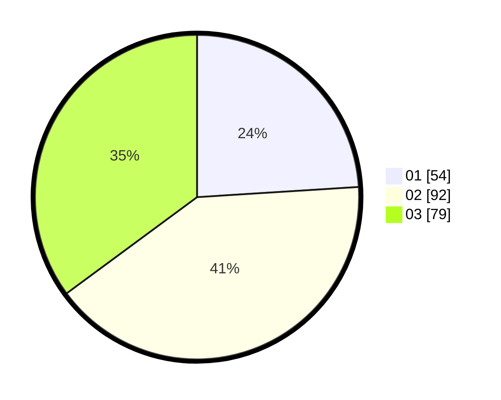

# Hasil

Hasil perolehan suara paslon dapat dilihat pada file paslon-01.txt, paslon-02.txt, dan paslon-03.txt.

Jika tidak ada, artinya data tersebut belum ada pada SIREKAP.

## Perolehan Suara

 * Paslon 01: **54**.
 * Paslon 02: **92**.
 * Paslon 03: **79**.

## Foto C Plano

https://sirekap-obj-formc.kpu.go.id/e461/pemilu/ppwp/31/72/04/10/02/3172041002147-20240216-175809--25574f7a-7e85-40ec-baac-1190bda95868.jpg

https://sirekap-obj-formc.kpu.go.id/e461/pemilu/ppwp/31/72/04/10/02/3172041002147-20240216-212742--ab92d3d8-44d9-473b-a9b3-75f02f38ba00.jpg

https://sirekap-obj-formc.kpu.go.id/e461/pemilu/ppwp/31/72/04/10/02/3172041002147-20240216-180655--5a2cd7cc-bcda-4b8a-8581-f7216d1defbb.jpg

## DATA PEMILIH TETAP

Jumlah pemilih dalam DPT: **293**.
 * L: **137**.
 * P: **156**.

## DATA PENGGUNA HAK PILIH

Jumlah pengguna hak pilih dalam DPT: **210**.
 * L: **100**.
 * P: **110**.

Jumlah pengguna hak pilih dalam DPTb: **7**.
 * L: **7**.
 * P: **0**.

Jumlah pengguna hak pilih dalam DPK: **8**.
 * L: **4**.
 * P: **4**.

Jumlah pengguna hak pilih: **225**.
 * L: **111**.
 * P: **114**.

## JUMLAH SUARA SAH DAN TIDAK SAH

JUMLAH SELURUH SUARA SAH: **225**.

JUMLAH SUARA TIDAK SAH: **0**.

JUMLAH SELURUH SUARA SAH DAN SUARA TIDAK SAH: **225**.
