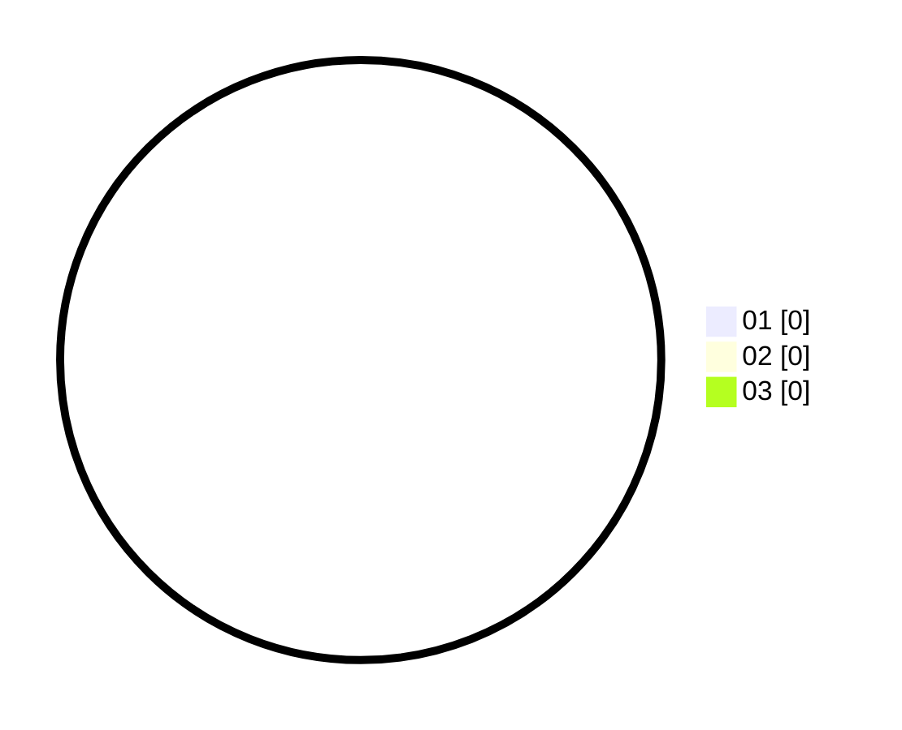

# Hasil

Hasil perolehan suara paslon dapat dilihat pada file paslon-01.txt, paslon-02.txt, dan paslon-03.txt.

Jika tidak ada, artinya data tersebut belum ada pada SIREKAP.

## Perolehan Suara

 * Paslon 01: **0**.
 * Paslon 02: **0**.
 * Paslon 03: **0**.

## Foto C Plano

https://sirekap-obj-formc.kpu.go.id/cfbc/pemilu/ppwp/31/72/04/10/02/3172041002148-20240215-052444--d3050e7f-cd4d-41ea-a591-418040434fee.jpg

https://sirekap-obj-formc.kpu.go.id/cfbc/pemilu/ppwp/31/72/04/10/02/3172041002148-20240215-052452--1b6b2cf8-8e1a-41f2-9fbf-298cd2810904.jpg

https://sirekap-obj-formc.kpu.go.id/cfbc/pemilu/ppwp/31/72/04/10/02/3172041002148-20240215-052459--125bbdfe-e77c-4b16-8b09-e19009297634.jpg

## DATA PEMILIH TETAP

Jumlah pemilih dalam DPT: **271**.
 * L: **127**.
 * P: **144**.

## DATA PENGGUNA HAK PILIH

Jumlah pengguna hak pilih dalam DPT: **198**.
 * L: **87**.
 * P: **111**.

Jumlah pengguna hak pilih dalam DPTb: **5**.
 * L: **4**.
 * P: **1**.

Jumlah pengguna hak pilih dalam DPK: **2**.
 * L: **0**.
 * P: **2**.

Jumlah pengguna hak pilih: **205**.
 * L: **91**.
 * P: **114**.

## JUMLAH SUARA SAH DAN TIDAK SAH

JUMLAH SELURUH SUARA SAH: **204**.

JUMLAH SUARA TIDAK SAH: **1**.

JUMLAH SELURUH SUARA SAH DAN SUARA TIDAK SAH: **205**.
