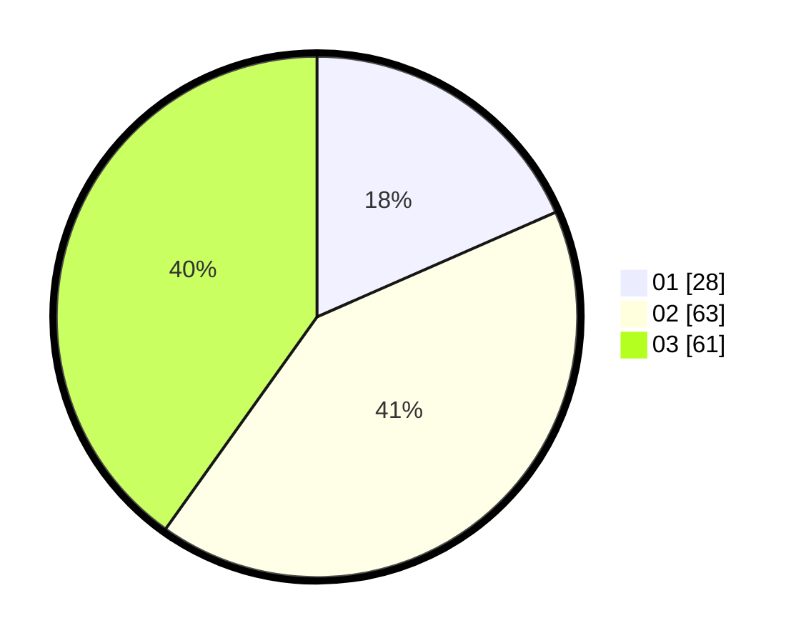

# Hasil

Hasil perolehan suara paslon dapat dilihat pada file paslon-01.txt, paslon-02.txt, dan paslon-03.txt.

Jika tidak ada, artinya data tersebut belum ada pada SIREKAP.

## Perolehan Suara

 * Paslon 01: **28**.
 * Paslon 02: **63**.
 * Paslon 03: **61**.

## Foto C Plano

https://sirekap-obj-formc.kpu.go.id/9b35/pemilu/ppwp/31/72/04/10/02/3172041002149-20240214-205817--c61fcc93-7e6b-4a8c-9cb4-70426fb4f442.jpg

https://sirekap-obj-formc.kpu.go.id/9b35/pemilu/ppwp/31/72/04/10/02/3172041002149-20240214-205857--0a8baa43-cb33-4c66-a74d-d3b7406b6b33.jpg

https://sirekap-obj-formc.kpu.go.id/9b35/pemilu/ppwp/31/72/04/10/02/3172041002149-20240214-205943--065b210d-fa31-4ff5-b730-328f5acaecf1.jpg

## DATA PEMILIH TETAP

Jumlah pemilih dalam DPT: **218**.
 * L: **107**.
 * P: **111**.

## DATA PENGGUNA HAK PILIH

Jumlah pengguna hak pilih dalam DPT: **141**.
 * L: **64**.
 * P: **77**.

Jumlah pengguna hak pilih dalam DPTb: **11**.
 * L: **7**.
 * P: **4**.

Jumlah pengguna hak pilih dalam DPK: **2**.
 * L: **1**.
 * P: **1**.

Jumlah pengguna hak pilih: **154**.
 * L: **72**.
 * P: **82**.

## JUMLAH SUARA SAH DAN TIDAK SAH

JUMLAH SELURUH SUARA SAH: **152**.

JUMLAH SUARA TIDAK SAH: **2**.

JUMLAH SELURUH SUARA SAH DAN SUARA TIDAK SAH: **154**.
