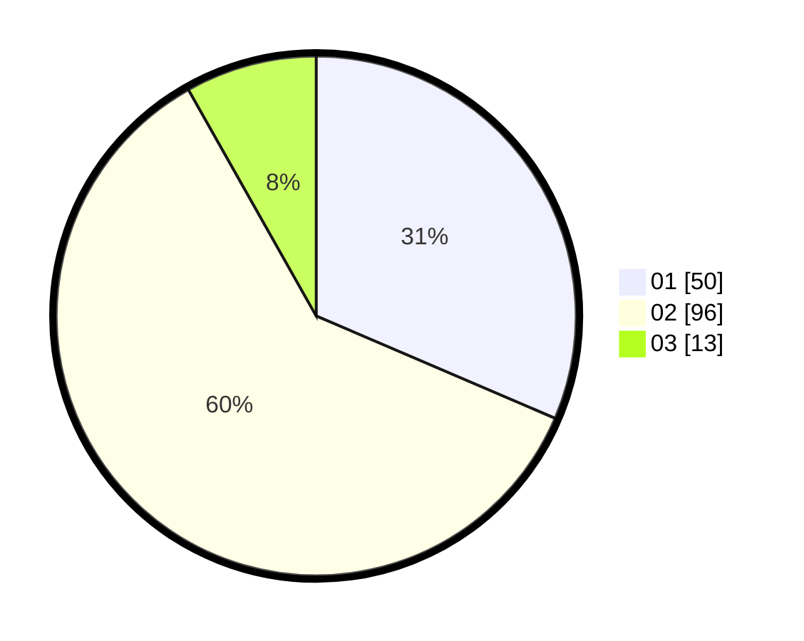

# Hasil

Hasil perolehan suara paslon dapat dilihat pada file paslon-01.txt, paslon-02.txt, dan paslon-03.txt.

Jika tidak ada, artinya data tersebut belum ada pada SIREKAP.

## Perolehan Suara

 * Paslon 01: **50**.
 * Paslon 02: **96**.
 * Paslon 03: **13**.

## Foto C Plano

https://sirekap-obj-formc.kpu.go.id/4c9e/pemilu/ppwp/31/72/04/10/02/3172041002156-20240214-184441--32f08804-93fc-4ed0-a7eb-23ed2399cda7.jpg

https://sirekap-obj-formc.kpu.go.id/4c9e/pemilu/ppwp/31/72/04/10/02/3172041002156-20240214-185427--7cc51dd5-ee44-4e2a-b8bd-0268c11ba8af.jpg

https://sirekap-obj-formc.kpu.go.id/4c9e/pemilu/ppwp/31/72/04/10/02/3172041002156-20240214-191117--7d56ce73-5588-45f8-a83e-4b57580aacf2.jpg

## DATA PEMILIH TETAP

Jumlah pemilih dalam DPT: **284**.
 * L: **148**.
 * P: **136**.

## DATA PENGGUNA HAK PILIH

Jumlah pengguna hak pilih dalam DPT: **158**.
 * L: **80**.
 * P: **78**.

Jumlah pengguna hak pilih dalam DPTb: **1**.
 * L: **1**.
 * P: **0**.

Jumlah pengguna hak pilih dalam DPK: **0**.
 * L: **0**.
 * P: **0**.

Jumlah pengguna hak pilih: **159**.
 * L: **81**.
 * P: **78**.

## JUMLAH SUARA SAH DAN TIDAK SAH

JUMLAH SELURUH SUARA SAH: **159**.

JUMLAH SUARA TIDAK SAH: **0**.

JUMLAH SELURUH SUARA SAH DAN SUARA TIDAK SAH: **159**.
