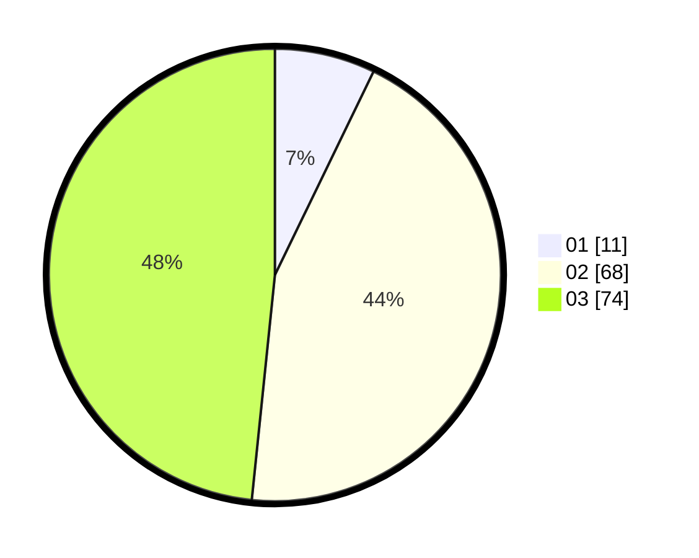

# Hasil

Hasil perolehan suara paslon dapat dilihat pada file paslon-01.txt, paslon-02.txt, dan paslon-03.txt.

Jika tidak ada, artinya data tersebut belum ada pada SIREKAP.

## Perolehan Suara

 * Paslon 01: **11**.
 * Paslon 02: **68**.
 * Paslon 03: **74**.

## Foto C Plano

https://sirekap-obj-formc.kpu.go.id/791b/pemilu/ppwp/31/72/04/10/02/3172041002177-20240214-194226--200b92f8-e1f2-4801-abc7-cbce7de738ac.jpg

https://sirekap-obj-formc.kpu.go.id/791b/pemilu/ppwp/31/72/04/10/02/3172041002177-20240214-194236--d52c473e-eb91-4658-a303-1b9a50fab6a9.jpg

https://sirekap-obj-formc.kpu.go.id/791b/pemilu/ppwp/31/72/04/10/02/3172041002177-20240214-194250--2548efaa-6815-4732-8205-362982368528.jpg

## DATA PEMILIH TETAP

Jumlah pemilih dalam DPT: **224**.
 * L: **107**.
 * P: **117**.

## DATA PENGGUNA HAK PILIH

Jumlah pengguna hak pilih dalam DPT: **150**.
 * L: **73**.
 * P: **77**.

Jumlah pengguna hak pilih dalam DPTb: **2**.
 * L: **1**.
 * P: **1**.

Jumlah pengguna hak pilih dalam DPK: **2**.
 * L: **1**.
 * P: **1**.

Jumlah pengguna hak pilih: **154**.
 * L: **75**.
 * P: **79**.

## JUMLAH SUARA SAH DAN TIDAK SAH

JUMLAH SELURUH SUARA SAH: **153**.

JUMLAH SUARA TIDAK SAH: **1**.

JUMLAH SELURUH SUARA SAH DAN SUARA TIDAK SAH: **154**.
