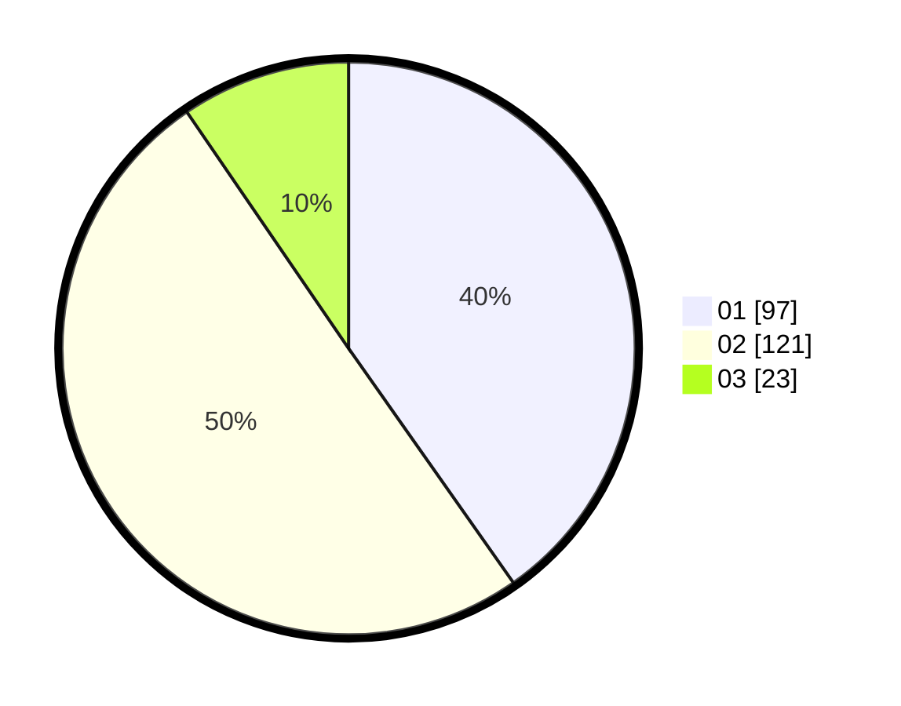

# Hasil

Hasil perolehan suara paslon dapat dilihat pada file paslon-01.txt, paslon-02.txt, dan paslon-03.txt.

Jika tidak ada, artinya data tersebut belum ada pada SIREKAP.

## Perolehan Suara

 * Paslon 01: **97**.
 * Paslon 02: **121**.
 * Paslon 03: **23**.

## Foto C Plano

https://sirekap-obj-formc.kpu.go.id/35c9/pemilu/ppwp/31/72/04/10/03/3172041003013-20240215-073507--c50d4874-7a5d-4ff0-a2be-c8acbd67b39a.jpg

https://sirekap-obj-formc.kpu.go.id/35c9/pemilu/ppwp/31/72/04/10/03/3172041003013-20240215-065550--1b94ffc5-175f-4219-901f-3d0c16de9860.jpg

https://sirekap-obj-formc.kpu.go.id/35c9/pemilu/ppwp/31/72/04/10/03/3172041003013-20240214-231708--577e8e4d-a70c-42bd-b6d0-cd4a8979af7f.jpg

## DATA PEMILIH TETAP

Jumlah pemilih dalam DPT: **296**.
 * L: **150**.
 * P: **146**.

## DATA PENGGUNA HAK PILIH

Jumlah pengguna hak pilih dalam DPT: **244**.
 * L: **126**.
 * P: **118**.

Jumlah pengguna hak pilih dalam DPTb: **1**.
 * L: **1**.
 * P: **0**.

Jumlah pengguna hak pilih dalam DPK: **5**.
 * L: **4**.
 * P: **1**.

Jumlah pengguna hak pilih: **250**.
 * L: **131**.
 * P: **119**.

## JUMLAH SUARA SAH DAN TIDAK SAH

JUMLAH SELURUH SUARA SAH: **241**.

JUMLAH SUARA TIDAK SAH: **9**.

JUMLAH SELURUH SUARA SAH DAN SUARA TIDAK SAH: **250**.
