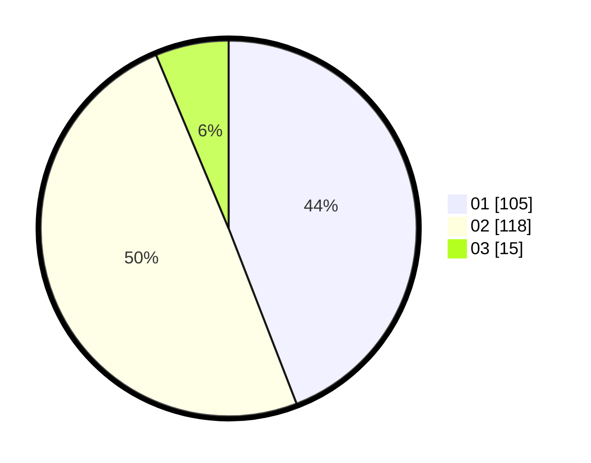

# Hasil

Hasil perolehan suara paslon dapat dilihat pada file paslon-01.txt, paslon-02.txt, dan paslon-03.txt.

Jika tidak ada, artinya data tersebut belum ada pada SIREKAP.

## Perolehan Suara

 * Paslon 01: **105**.
 * Paslon 02: **118**.
 * Paslon 03: **15**.

## Foto C Plano

https://sirekap-obj-formc.kpu.go.id/938e/pemilu/ppwp/31/72/04/10/03/3172041003023-20240215-001740--83f1de90-d6c4-422d-9161-21600b95ed4e.jpg

https://sirekap-obj-formc.kpu.go.id/938e/pemilu/ppwp/31/72/04/10/03/3172041003023-20240215-002243--a3e7f310-21ef-4bd6-a318-720001128305.jpg

https://sirekap-obj-formc.kpu.go.id/938e/pemilu/ppwp/31/72/04/10/03/3172041003023-20240215-002621--12d39f1a-70ad-4815-8109-99b4f3485912.jpg

## DATA PEMILIH TETAP

Jumlah pemilih dalam DPT: **297**.
 * L: **146**.
 * P: **151**.

## DATA PENGGUNA HAK PILIH

Jumlah pengguna hak pilih dalam DPT: **241**.
 * L: **117**.
 * P: **124**.

Jumlah pengguna hak pilih dalam DPTb: **0**.
 * L: **0**.
 * P: **0**.

Jumlah pengguna hak pilih dalam DPK: **1**.
 * L: **0**.
 * P: **1**.

Jumlah pengguna hak pilih: **242**.
 * L: **117**.
 * P: **125**.

## JUMLAH SUARA SAH DAN TIDAK SAH

JUMLAH SELURUH SUARA SAH: **236**.

JUMLAH SUARA TIDAK SAH: **6**.

JUMLAH SELURUH SUARA SAH DAN SUARA TIDAK SAH: **242**.
