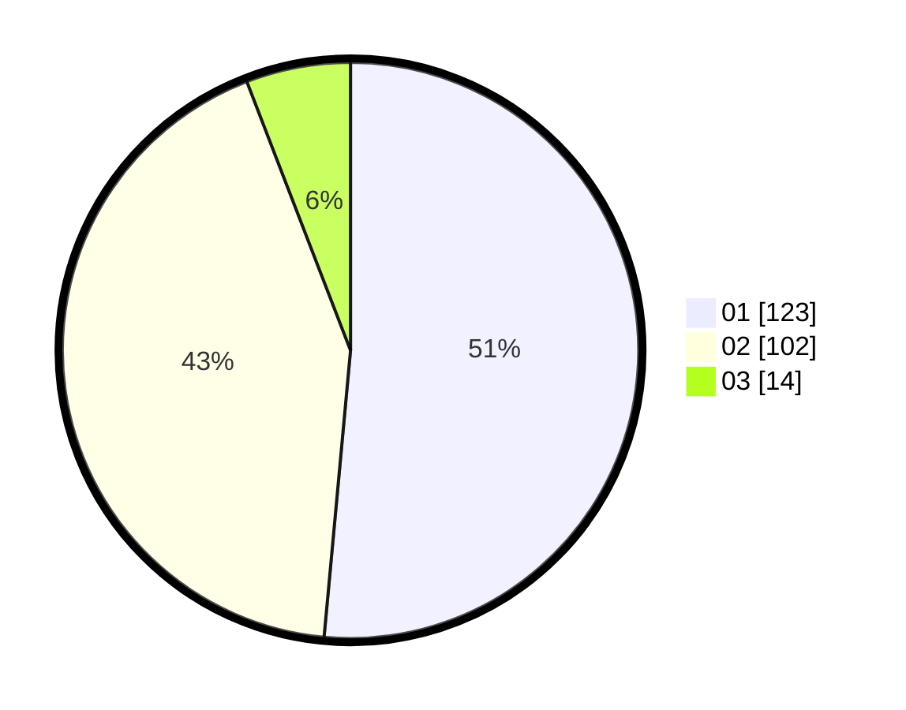

# Hasil

Hasil perolehan suara paslon dapat dilihat pada file paslon-01.txt, paslon-02.txt, dan paslon-03.txt.

Jika tidak ada, artinya data tersebut belum ada pada SIREKAP.

## Perolehan Suara

 * Paslon 01: **123**.
 * Paslon 02: **102**.
 * Paslon 03: **14**.

## Foto C Plano

https://sirekap-obj-formc.kpu.go.id/c918/pemilu/ppwp/31/72/04/10/03/3172041003030-20240214-155646--4e43d150-b56f-4a68-9b99-90edc1922f10.jpg

https://sirekap-obj-formc.kpu.go.id/c918/pemilu/ppwp/31/72/04/10/03/3172041003030-20240214-162215--b0f7c238-4af8-4152-80bd-2d4a53b4713e.jpg

https://sirekap-obj-formc.kpu.go.id/c918/pemilu/ppwp/31/72/04/10/03/3172041003030-20240214-162231--300d5bc9-59ff-416c-a8ab-1fedab781871.jpg

## DATA PEMILIH TETAP

Jumlah pemilih dalam DPT: **296**.
 * L: **142**.
 * P: **154**.

## DATA PENGGUNA HAK PILIH

Jumlah pengguna hak pilih dalam DPT: **236**.
 * L: **112**.
 * P: **124**.

Jumlah pengguna hak pilih dalam DPTb: **4**.
 * L: **3**.
 * P: **1**.

Jumlah pengguna hak pilih dalam DPK: **0**.
 * L: **0**.
 * P: **0**.

Jumlah pengguna hak pilih: **240**.
 * L: **115**.
 * P: **125**.

## JUMLAH SUARA SAH DAN TIDAK SAH

JUMLAH SELURUH SUARA SAH: **239**.

JUMLAH SUARA TIDAK SAH: **1**.

JUMLAH SELURUH SUARA SAH DAN SUARA TIDAK SAH: **240**.
