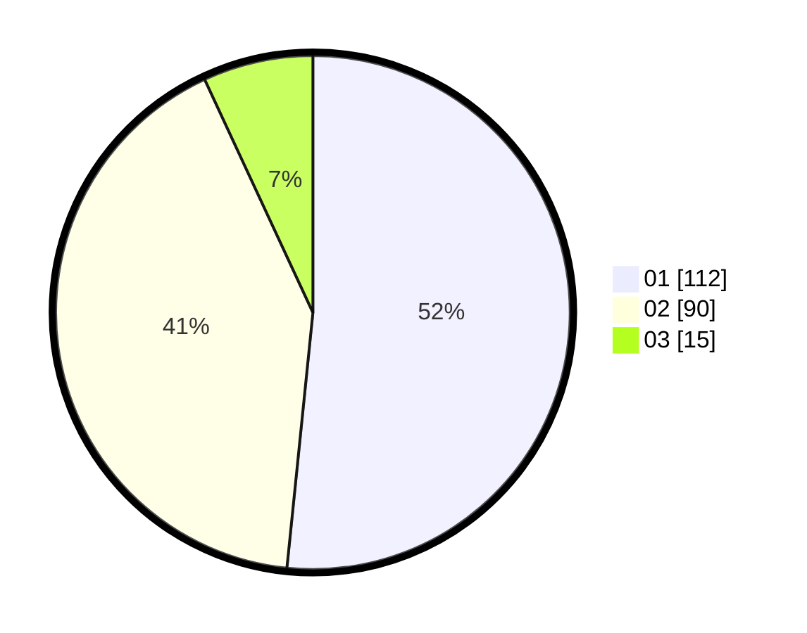

# Hasil

Hasil perolehan suara paslon dapat dilihat pada file paslon-01.txt, paslon-02.txt, dan paslon-03.txt.

Jika tidak ada, artinya data tersebut belum ada pada SIREKAP.

## Perolehan Suara

 * Paslon 01: **112**.
 * Paslon 02: **90**.
 * Paslon 03: **15**.

## Foto C Plano

https://sirekap-obj-formc.kpu.go.id/58b5/pemilu/ppwp/31/72/04/10/03/3172041003031-20240215-222155--b95fefd6-d8a8-4c75-917c-a4c6c6b71183.jpg

https://sirekap-obj-formc.kpu.go.id/58b5/pemilu/ppwp/31/72/04/10/03/3172041003031-20240215-222156--24aa671f-d13c-40e9-9783-9ac2398b0236.jpg

https://sirekap-obj-formc.kpu.go.id/58b5/pemilu/ppwp/31/72/04/10/03/3172041003031-20240215-222155--d52f0693-a36d-4f06-950c-abbe774aacfe.jpg

## DATA PEMILIH TETAP

Jumlah pemilih dalam DPT: **288**.
 * L: **149**.
 * P: **139**.

## DATA PENGGUNA HAK PILIH

Jumlah pengguna hak pilih dalam DPT: **217**.
 * L: **105**.
 * P: **112**.

Jumlah pengguna hak pilih dalam DPTb: **2**.
 * L: **0**.
 * P: **2**.

Jumlah pengguna hak pilih dalam DPK: **0**.
 * L: **0**.
 * P: **0**.

Jumlah pengguna hak pilih: **219**.
 * L: **105**.
 * P: **114**.

## JUMLAH SUARA SAH DAN TIDAK SAH

JUMLAH SELURUH SUARA SAH: **217**.

JUMLAH SUARA TIDAK SAH: **2**.

JUMLAH SELURUH SUARA SAH DAN SUARA TIDAK SAH: **219**.
