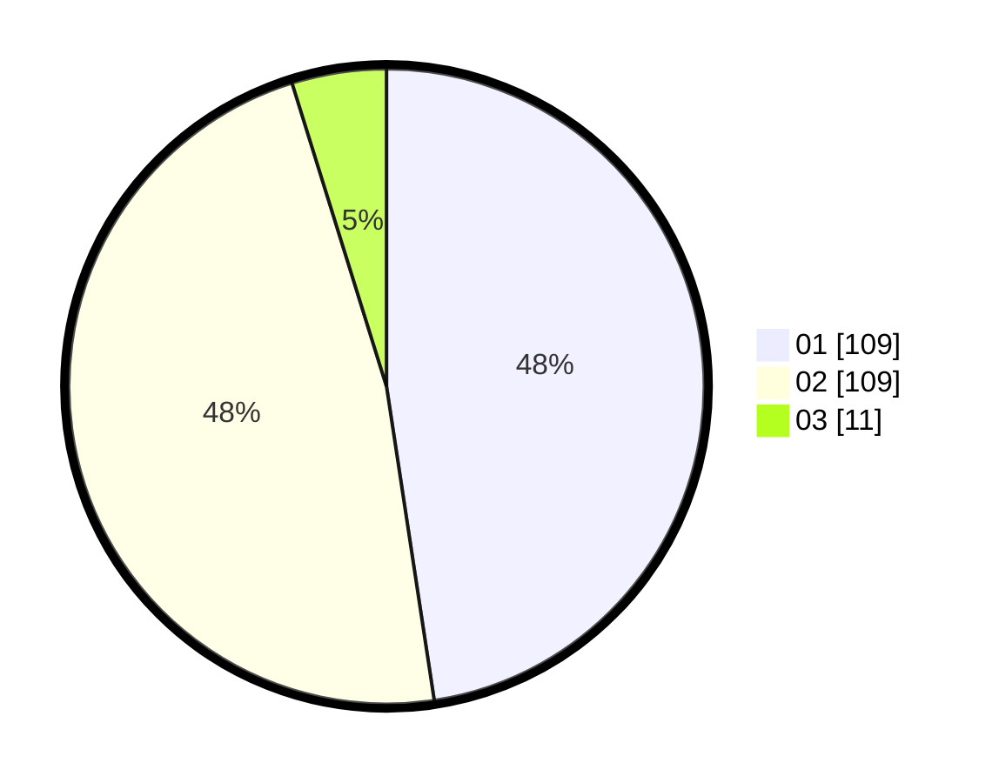

# Hasil

Hasil perolehan suara paslon dapat dilihat pada file paslon-01.txt, paslon-02.txt, dan paslon-03.txt.

Jika tidak ada, artinya data tersebut belum ada pada SIREKAP.

## Perolehan Suara

 * Paslon 01: **109**.
 * Paslon 02: **109**.
 * Paslon 03: **11**.

## Foto C Plano

https://sirekap-obj-formc.kpu.go.id/19fe/pemilu/ppwp/31/72/04/10/03/3172041003035-20240214-225431--6f55fcc8-7a86-46bc-8b62-0032b5a0475e.jpg

https://sirekap-obj-formc.kpu.go.id/19fe/pemilu/ppwp/31/72/04/10/03/3172041003035-20240214-225307--d822e5d8-6dc9-41e3-ac60-1289b50eba8e.jpg

https://sirekap-obj-formc.kpu.go.id/19fe/pemilu/ppwp/31/72/04/10/03/3172041003035-20240214-225529--c5a99338-1595-4d85-abee-e331b16a9d16.jpg
