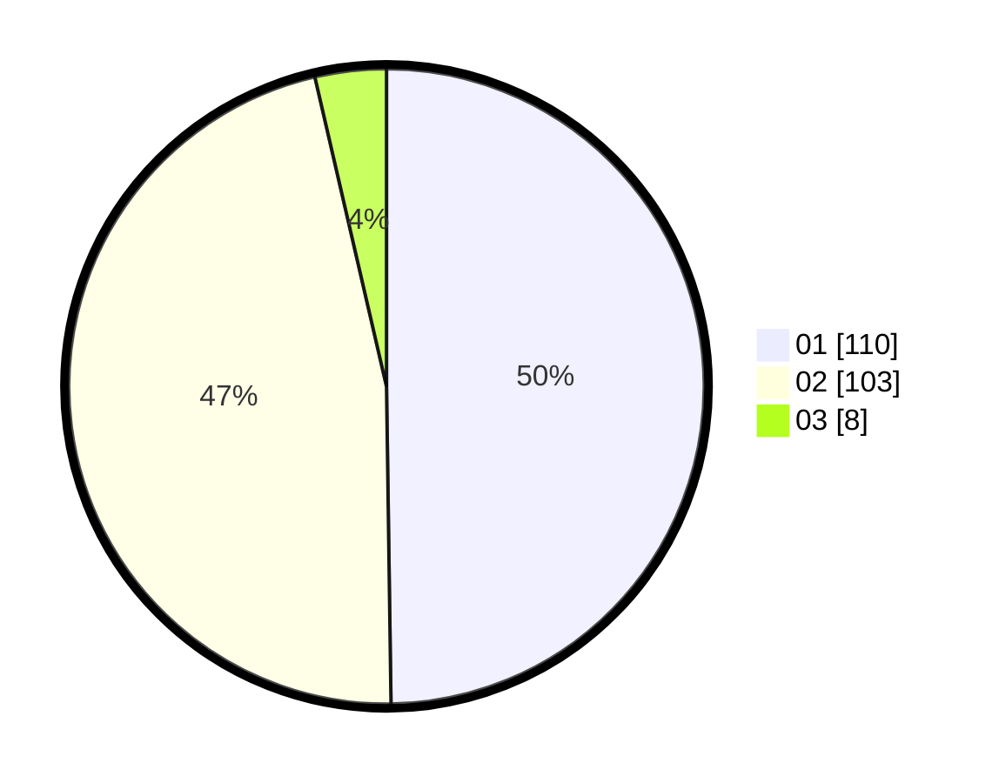

# Hasil

Hasil perolehan suara paslon dapat dilihat pada file paslon-01.txt, paslon-02.txt, dan paslon-03.txt.

Jika tidak ada, artinya data tersebut belum ada pada SIREKAP.

## Perolehan Suara

 * Paslon 01: **110**.
 * Paslon 02: **103**.
 * Paslon 03: **8**.

## Foto C Plano

https://sirekap-obj-formc.kpu.go.id/1408/pemilu/ppwp/31/72/04/10/03/3172041003040-20240214-213928--6a0c841d-f160-4041-aea4-06fc66972353.jpg

https://sirekap-obj-formc.kpu.go.id/1408/pemilu/ppwp/31/72/04/10/03/3172041003040-20240214-200653--c5e79a07-667a-4091-9baf-c41b7518bdb6.jpg

https://sirekap-obj-formc.kpu.go.id/1408/pemilu/ppwp/31/72/04/10/03/3172041003040-20240214-201212--e07e8bf6-1333-466d-965f-151a760385b3.jpg
