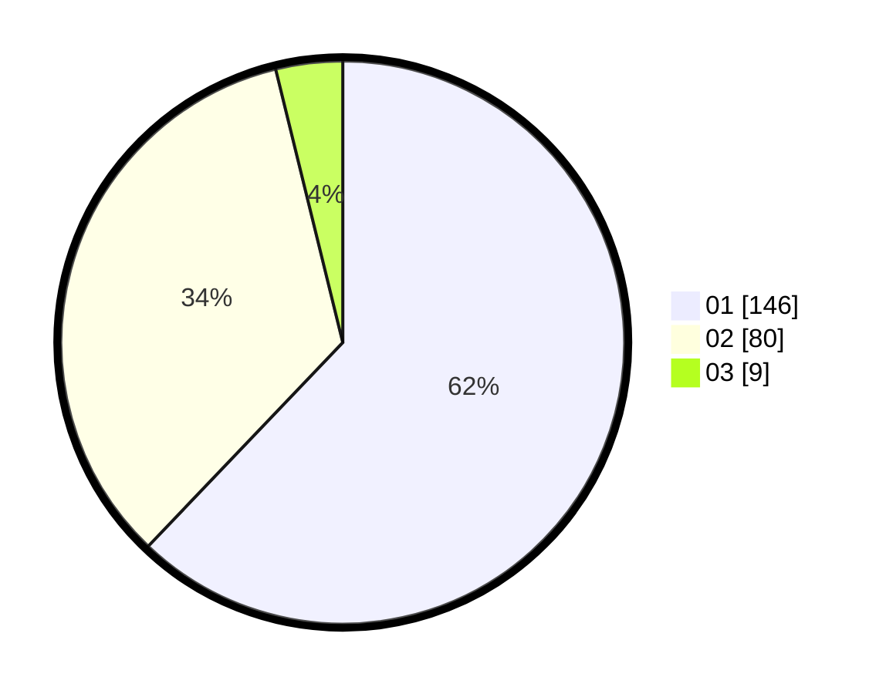

# Hasil

Hasil perolehan suara paslon dapat dilihat pada file paslon-01.txt, paslon-02.txt, dan paslon-03.txt.

Jika tidak ada, artinya data tersebut belum ada pada SIREKAP.

## Perolehan Suara

 * Paslon 01: **146**.
 * Paslon 02: **80**.
 * Paslon 03: **9**.

## Foto C Plano

https://sirekap-obj-formc.kpu.go.id/7abf/pemilu/ppwp/31/72/04/10/03/3172041003043-20240215-023048--af7288f3-f9dd-4b5b-8f61-34c4f04320e3.jpg

https://sirekap-obj-formc.kpu.go.id/7abf/pemilu/ppwp/31/72/04/10/03/3172041003043-20240215-023215--ad992669-c89d-4fd0-8315-2011c3e1ddf2.jpg

https://sirekap-obj-formc.kpu.go.id/7abf/pemilu/ppwp/31/72/04/10/03/3172041003043-20240215-165225--7cb606f7-b6dd-4278-91bb-c22ab525e0f8.jpg
