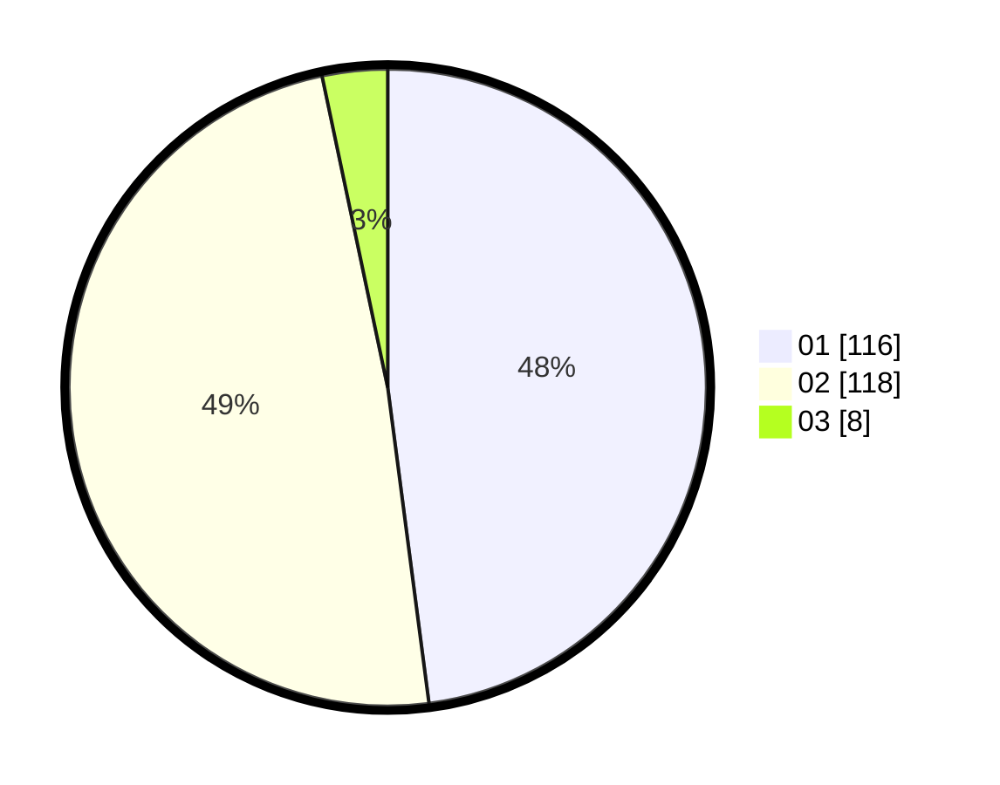

# Hasil

Hasil perolehan suara paslon dapat dilihat pada file paslon-01.txt, paslon-02.txt, dan paslon-03.txt.

Jika tidak ada, artinya data tersebut belum ada pada SIREKAP.

## Perolehan Suara

 * Paslon 01: **116**.
 * Paslon 02: **118**.
 * Paslon 03: **8**.

## Foto C Plano

https://sirekap-obj-formc.kpu.go.id/05dd/pemilu/ppwp/31/72/04/10/03/3172041003048-20240215-181733--80c97b0d-6650-4e6b-ad9f-bb82aaf4e512.jpg

https://sirekap-obj-formc.kpu.go.id/05dd/pemilu/ppwp/31/72/04/10/03/3172041003048-20240215-181757--ea927a50-3f21-44be-aa07-e140c941e98d.jpg

https://sirekap-obj-formc.kpu.go.id/05dd/pemilu/ppwp/31/72/04/10/03/3172041003048-20240215-181746--7970fb5f-8431-4585-9c82-293c3793526f.jpg

## DATA PEMILIH TETAP

Jumlah pemilih dalam DPT: **293**.
 * L: **145**.
 * P: **148**.

## DATA PENGGUNA HAK PILIH

Jumlah pengguna hak pilih dalam DPT: **239**.
 * L: **110**.
 * P: **129**.

Jumlah pengguna hak pilih dalam DPTb: **0**.
 * L: **0**.
 * P: **0**.

Jumlah pengguna hak pilih dalam DPK: **7**.
 * L: **4**.
 * P: **3**.

Jumlah pengguna hak pilih: **246**.
 * L: **114**.
 * P: **132**.

## JUMLAH SUARA SAH DAN TIDAK SAH

JUMLAH SELURUH SUARA SAH: **242**.

JUMLAH SUARA TIDAK SAH: **4**.

JUMLAH SELURUH SUARA SAH DAN SUARA TIDAK SAH: **246**.
