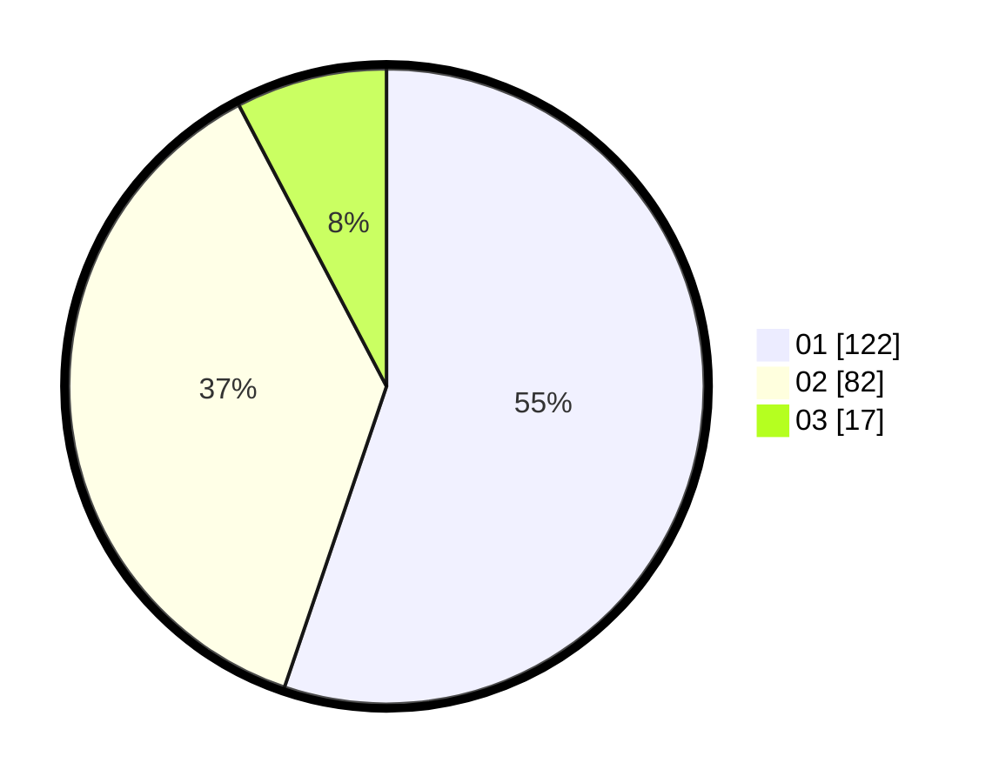

# Hasil

Hasil perolehan suara paslon dapat dilihat pada file paslon-01.txt, paslon-02.txt, dan paslon-03.txt.

Jika tidak ada, artinya data tersebut belum ada pada SIREKAP.

## Perolehan Suara

 * Paslon 01: **122**.
 * Paslon 02: **82**.
 * Paslon 03: **17**.

## Foto C Plano

https://sirekap-obj-formc.kpu.go.id/8582/pemilu/ppwp/31/72/04/10/03/3172041003049-20240214-155237--a51714a3-5384-45d7-8e09-d92e82606c0f.jpg

https://sirekap-obj-formc.kpu.go.id/8582/pemilu/ppwp/31/72/04/10/03/3172041003049-20240214-155623--b5c3b13e-de9a-49df-9487-a3f3f43272d7.jpg

https://sirekap-obj-formc.kpu.go.id/8582/pemilu/ppwp/31/72/04/10/03/3172041003049-20240214-155815--52ea9574-1925-48db-8519-6135363fa420.jpg
