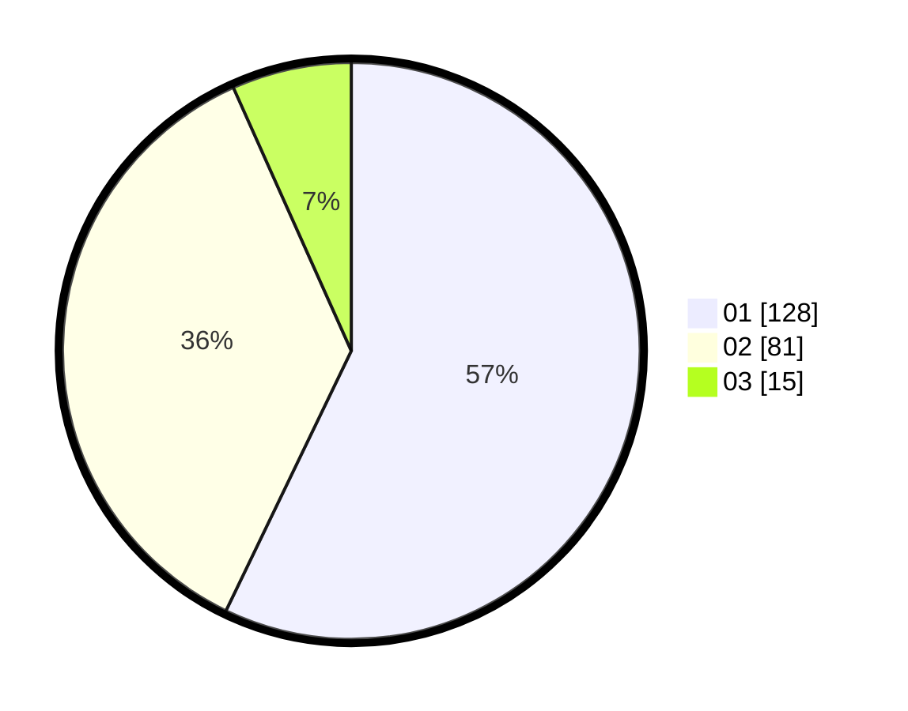

# Hasil

Hasil perolehan suara paslon dapat dilihat pada file paslon-01.txt, paslon-02.txt, dan paslon-03.txt.

Jika tidak ada, artinya data tersebut belum ada pada SIREKAP.

## Perolehan Suara

 * Paslon 01: **128**.
 * Paslon 02: **81**.
 * Paslon 03: **15**.

## Foto C Plano

https://sirekap-obj-formc.kpu.go.id/4527/pemilu/ppwp/31/72/04/10/03/3172041003050-20240214-222949--24e9a668-4567-4cce-b63d-c41d3c6831d8.jpg

https://sirekap-obj-formc.kpu.go.id/4527/pemilu/ppwp/31/72/04/10/03/3172041003050-20240214-205650--fc665d49-91e6-471c-bb0f-8b359c71ff0c.jpg

https://sirekap-obj-formc.kpu.go.id/4527/pemilu/ppwp/31/72/04/10/03/3172041003050-20240214-204443--b97ece0c-2ebb-4ca6-8479-2f57da05baf4.jpg

## DATA PEMILIH TETAP

Jumlah pemilih dalam DPT: **295**.
 * L: **137**.
 * P: **158**.

## DATA PENGGUNA HAK PILIH

Jumlah pengguna hak pilih dalam DPT: **225**.
 * L: **103**.
 * P: **122**.

Jumlah pengguna hak pilih dalam DPTb: **0**.
 * L: **0**.
 * P: **0**.

Jumlah pengguna hak pilih dalam DPK: **3**.
 * L: **2**.
 * P: **1**.

Jumlah pengguna hak pilih: **228**.
 * L: **105**.
 * P: **123**.

## JUMLAH SUARA SAH DAN TIDAK SAH

JUMLAH SELURUH SUARA SAH: **224**.

JUMLAH SUARA TIDAK SAH: **4**.

JUMLAH SELURUH SUARA SAH DAN SUARA TIDAK SAH: **228**.
