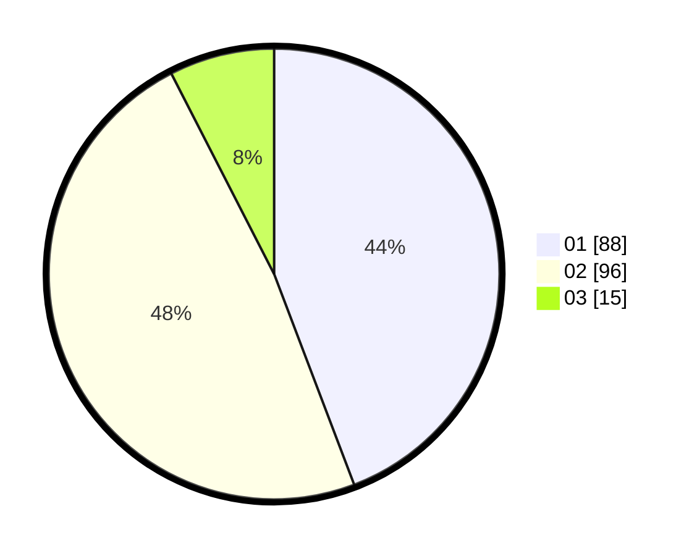

# Hasil

Hasil perolehan suara paslon dapat dilihat pada file paslon-01.txt, paslon-02.txt, dan paslon-03.txt.

Jika tidak ada, artinya data tersebut belum ada pada SIREKAP.

## Perolehan Suara

 * Paslon 01: **88**.
 * Paslon 02: **96**.
 * Paslon 03: **15**.

## Foto C Plano

https://sirekap-obj-formc.kpu.go.id/90a4/pemilu/ppwp/31/72/04/10/03/3172041003054-20240216-085858--698e1c8c-bd05-46cc-bf04-e9cc808d3c86.jpg

https://sirekap-obj-formc.kpu.go.id/90a4/pemilu/ppwp/31/72/04/10/03/3172041003054-20240216-085859--c3345fa2-3a3b-4341-b32b-8395d064fc52.jpg

https://sirekap-obj-formc.kpu.go.id/90a4/pemilu/ppwp/31/72/04/10/03/3172041003054-20240216-085858--7cd03416-7f54-4234-83c7-7a743c47d904.jpg

## DATA PEMILIH TETAP

Jumlah pemilih dalam DPT: **270**.
 * L: **127**.
 * P: **143**.

## DATA PENGGUNA HAK PILIH

Jumlah pengguna hak pilih dalam DPT: **197**.
 * L: **91**.
 * P: **106**.

Jumlah pengguna hak pilih dalam DPTb: **0**.
 * L: **0**.
 * P: **0**.

Jumlah pengguna hak pilih dalam DPK: **4**.
 * L: **1**.
 * P: **3**.

Jumlah pengguna hak pilih: **201**.
 * L: **92**.
 * P: **109**.

## JUMLAH SUARA SAH DAN TIDAK SAH

JUMLAH SELURUH SUARA SAH: **199**.

JUMLAH SUARA TIDAK SAH: **2**.

JUMLAH SELURUH SUARA SAH DAN SUARA TIDAK SAH: **201**.
