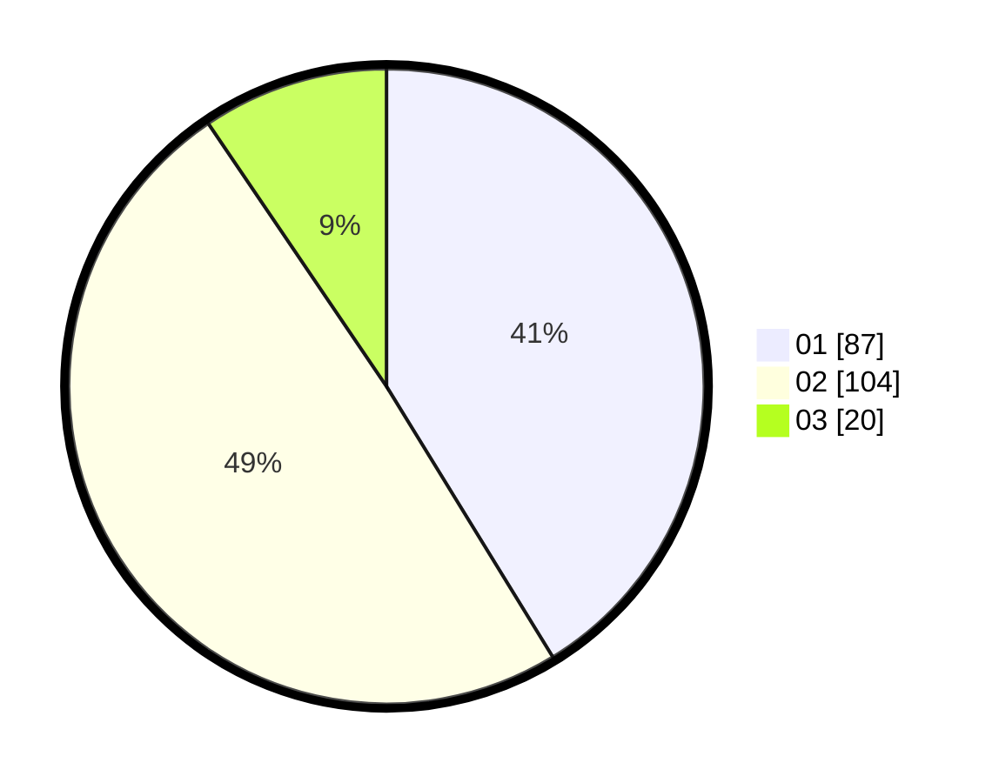

# Hasil

Hasil perolehan suara paslon dapat dilihat pada file paslon-01.txt, paslon-02.txt, dan paslon-03.txt.

Jika tidak ada, artinya data tersebut belum ada pada SIREKAP.

## Perolehan Suara

 * Paslon 01: **87**.
 * Paslon 02: **104**.
 * Paslon 03: **20**.

## Foto C Plano

https://sirekap-obj-formc.kpu.go.id/bf7d/pemilu/ppwp/31/72/04/10/03/3172041003055-20240214-155210--4e0510be-8086-40eb-9c02-091b6dcad597.jpg

https://sirekap-obj-formc.kpu.go.id/bf7d/pemilu/ppwp/31/72/04/10/03/3172041003055-20240214-192449--29341489-aaad-4384-aa5c-8937f3fcf098.jpg

https://sirekap-obj-formc.kpu.go.id/bf7d/pemilu/ppwp/31/72/04/10/03/3172041003055-20240214-192918--f2145f63-549e-4fbf-a349-d2b58f773aeb.jpg

## DATA PEMILIH TETAP

Jumlah pemilih dalam DPT: **273**.
 * L: **140**.
 * P: **133**.

## DATA PENGGUNA HAK PILIH

Jumlah pengguna hak pilih dalam DPT: **211**.
 * L: **107**.
 * P: **104**.

Jumlah pengguna hak pilih dalam DPTb: **1**.
 * L: **0**.
 * P: **1**.

Jumlah pengguna hak pilih dalam DPK: **2**.
 * L: **0**.
 * P: **2**.

Jumlah pengguna hak pilih: **214**.
 * L: **107**.
 * P: **107**.

## JUMLAH SUARA SAH DAN TIDAK SAH

JUMLAH SELURUH SUARA SAH: **211**.

JUMLAH SUARA TIDAK SAH: **3**.

JUMLAH SELURUH SUARA SAH DAN SUARA TIDAK SAH: **214**.
