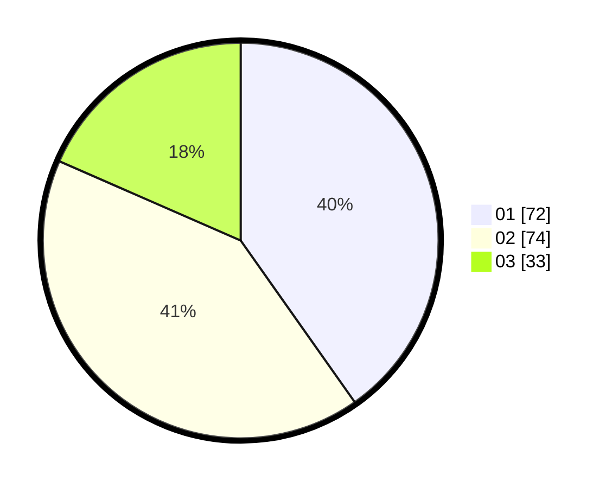

# Hasil

Hasil perolehan suara paslon dapat dilihat pada file paslon-01.txt, paslon-02.txt, dan paslon-03.txt.

Jika tidak ada, artinya data tersebut belum ada pada SIREKAP.

## Perolehan Suara

 * Paslon 01: **72**.
 * Paslon 02: **74**.
 * Paslon 03: **33**.

## Foto C Plano

https://sirekap-obj-formc.kpu.go.id/2b27/pemilu/ppwp/31/72/04/10/03/3172041003057-20240215-013014--d4a90461-4324-4f48-896d-bf8548c738e4.jpg

https://sirekap-obj-formc.kpu.go.id/2b27/pemilu/ppwp/31/72/04/10/03/3172041003057-20240215-013140--cdf5ea87-6a10-46f1-b194-f364c555bc76.jpg

https://sirekap-obj-formc.kpu.go.id/2b27/pemilu/ppwp/31/72/04/10/03/3172041003057-20240215-013221--78143510-205b-4c70-92a8-8fb581d6c725.jpg

## DATA PEMILIH TETAP

Jumlah pemilih dalam DPT: **228**.
 * L: **119**.
 * P: **109**.

## DATA PENGGUNA HAK PILIH

Jumlah pengguna hak pilih dalam DPT: **180**.
 * L: **95**.
 * P: **85**.

Jumlah pengguna hak pilih dalam DPTb: **0**.
 * L: **0**.
 * P: **0**.

Jumlah pengguna hak pilih dalam DPK: **1**.
 * L: **0**.
 * P: **1**.

Jumlah pengguna hak pilih: **181**.
 * L: **95**.
 * P: **86**.

## JUMLAH SUARA SAH DAN TIDAK SAH

JUMLAH SELURUH SUARA SAH: **179**.

JUMLAH SUARA TIDAK SAH: **2**.

JUMLAH SELURUH SUARA SAH DAN SUARA TIDAK SAH: **181**.
