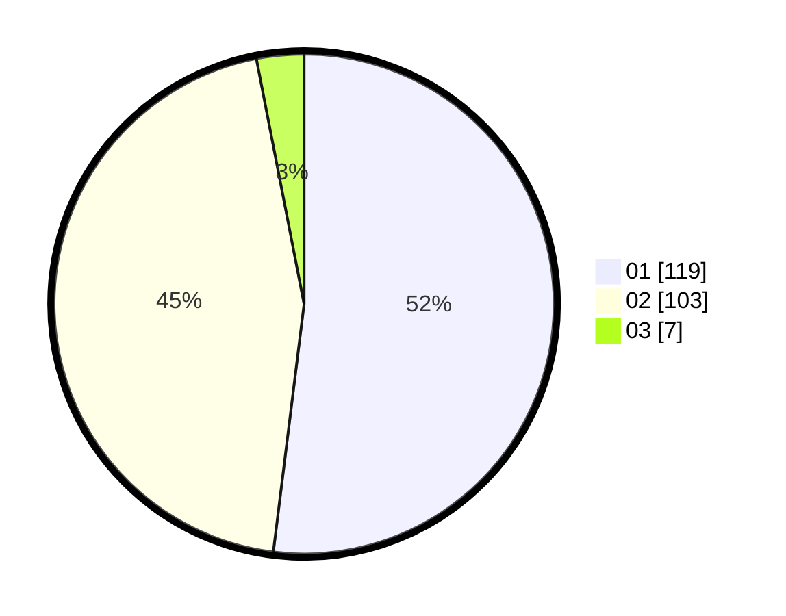

# Hasil

Hasil perolehan suara paslon dapat dilihat pada file paslon-01.txt, paslon-02.txt, dan paslon-03.txt.

Jika tidak ada, artinya data tersebut belum ada pada SIREKAP.

## Perolehan Suara

 * Paslon 01: **119**.
 * Paslon 02: **103**.
 * Paslon 03: **7**.

## Foto C Plano

https://sirekap-obj-formc.kpu.go.id/6050/pemilu/ppwp/31/72/04/10/03/3172041003059-20240214-155820--cb86afe5-83f8-4c78-8e5a-98390277dc06.jpg

https://sirekap-obj-formc.kpu.go.id/6050/pemilu/ppwp/31/72/04/10/03/3172041003059-20240214-155500--9d6b9543-0f42-473e-9e67-21424033fd46.jpg

https://sirekap-obj-formc.kpu.go.id/6050/pemilu/ppwp/31/72/04/10/03/3172041003059-20240214-155454--5b5ad2fa-e918-4613-8a77-9831540d7931.jpg

## DATA PEMILIH TETAP

Jumlah pemilih dalam DPT: **286**.
 * L: **147**.
 * P: **139**.

## DATA PENGGUNA HAK PILIH

Jumlah pengguna hak pilih dalam DPT: **229**.
 * L: **107**.
 * P: **122**.

Jumlah pengguna hak pilih dalam DPTb: **1**.
 * L: **1**.
 * P: **0**.

Jumlah pengguna hak pilih dalam DPK: **3**.
 * L: **2**.
 * P: **1**.

Jumlah pengguna hak pilih: **233**.
 * L: **110**.
 * P: **123**.

## JUMLAH SUARA SAH DAN TIDAK SAH

JUMLAH SELURUH SUARA SAH: **229**.

JUMLAH SUARA TIDAK SAH: **4**.

JUMLAH SELURUH SUARA SAH DAN SUARA TIDAK SAH: **233**.
