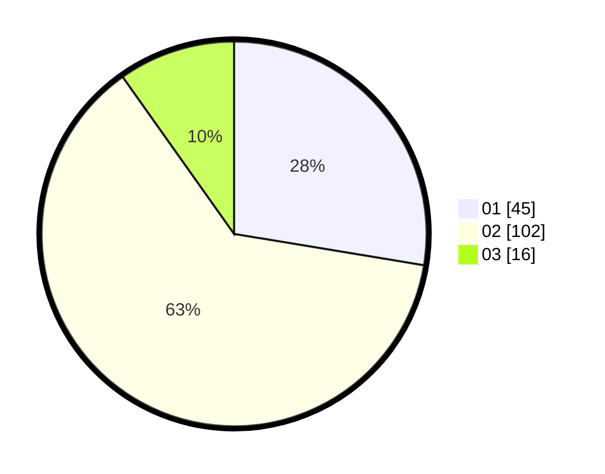

# Hasil

Hasil perolehan suara paslon dapat dilihat pada file paslon-01.txt, paslon-02.txt, dan paslon-03.txt.

Jika tidak ada, artinya data tersebut belum ada pada SIREKAP.

## Perolehan Suara

 * Paslon 01: **45**.
 * Paslon 02: **102**.
 * Paslon 03: **16**.

## Foto C Plano

https://sirekap-obj-formc.kpu.go.id/14c7/pemilu/ppwp/31/72/04/10/03/3172041003064-20240214-194625--69dd3401-c0bd-4fd6-8ab8-7b9448bf7f49.jpg

https://sirekap-obj-formc.kpu.go.id/14c7/pemilu/ppwp/31/72/04/10/03/3172041003064-20240214-194323--b5b4fd79-2531-4490-affa-f219c14dd6e6.jpg

https://sirekap-obj-formc.kpu.go.id/14c7/pemilu/ppwp/31/72/04/10/03/3172041003064-20240214-194859--ba4a3983-1651-4c9c-8c9f-281470451007.jpg

## DATA PEMILIH TETAP

Jumlah pemilih dalam DPT: **215**.
 * L: **100**.
 * P: **115**.

## DATA PENGGUNA HAK PILIH

Jumlah pengguna hak pilih dalam DPT: **166**.
 * L: **80**.
 * P: **86**.

Jumlah pengguna hak pilih dalam DPTb: **0**.
 * L: **0**.
 * P: **0**.

Jumlah pengguna hak pilih dalam DPK: **0**.
 * L: **1**.
 * P: **0**.

Jumlah pengguna hak pilih: **167**.
 * L: **81**.
 * P: **86**.

## JUMLAH SUARA SAH DAN TIDAK SAH

JUMLAH SELURUH SUARA SAH: **163**.

JUMLAH SUARA TIDAK SAH: **4**.

JUMLAH SELURUH SUARA SAH DAN SUARA TIDAK SAH: **167**.
