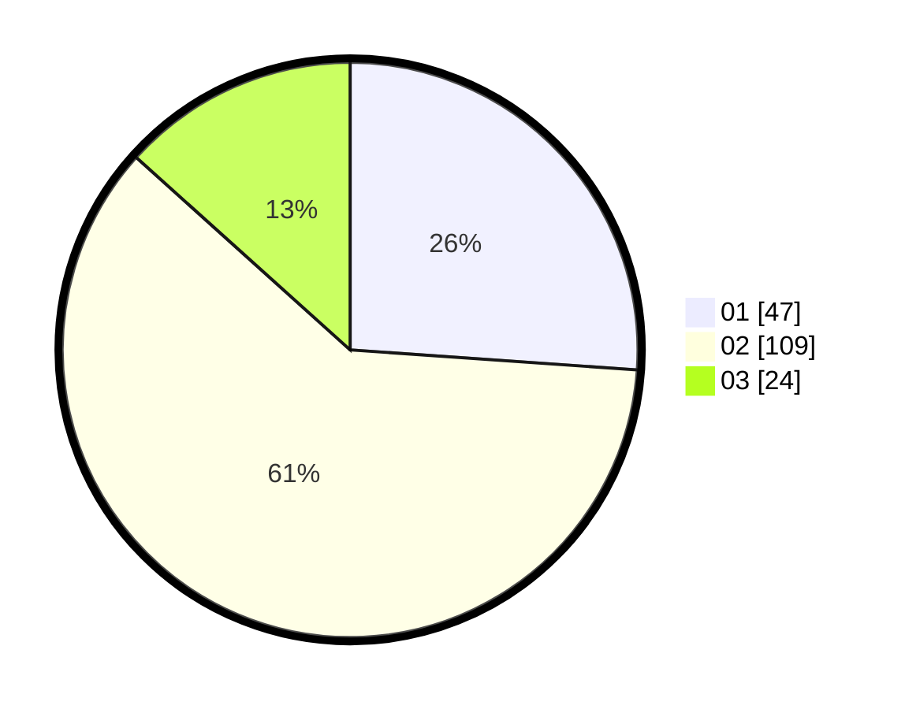

# Hasil

Hasil perolehan suara paslon dapat dilihat pada file paslon-01.txt, paslon-02.txt, dan paslon-03.txt.

Jika tidak ada, artinya data tersebut belum ada pada SIREKAP.

## Perolehan Suara

 * Paslon 01: **47**.
 * Paslon 02: **109**.
 * Paslon 03: **24**.

## Foto C Plano

https://sirekap-obj-formc.kpu.go.id/f6ea/pemilu/ppwp/31/72/04/10/03/3172041003065-20240214-190032--c56b11c8-3fe6-465f-aa20-1a933cd02a8a.jpg

https://sirekap-obj-formc.kpu.go.id/f6ea/pemilu/ppwp/31/72/04/10/03/3172041003065-20240214-190432--e235a8de-8c4b-4136-b9e3-f83e830c005f.jpg

https://sirekap-obj-formc.kpu.go.id/f6ea/pemilu/ppwp/31/72/04/10/03/3172041003065-20240214-190740--c5aa6d94-ea8e-4d35-9e3c-cc8c9ed6db90.jpg

## DATA PEMILIH TETAP

Jumlah pemilih dalam DPT: **217**.
 * L: **118**.
 * P: **99**.

## DATA PENGGUNA HAK PILIH

Jumlah pengguna hak pilih dalam DPT: **189**.
 * L: **104**.
 * P: **85**.

Jumlah pengguna hak pilih dalam DPTb: **0**.
 * L: **0**.
 * P: **0**.

Jumlah pengguna hak pilih dalam DPK: **0**.
 * L: **0**.
 * P: **0**.

Jumlah pengguna hak pilih: **189**.
 * L: **104**.
 * P: **85**.

## JUMLAH SUARA SAH DAN TIDAK SAH

JUMLAH SELURUH SUARA SAH: **180**.

JUMLAH SUARA TIDAK SAH: **9**.

JUMLAH SELURUH SUARA SAH DAN SUARA TIDAK SAH: **189**.
