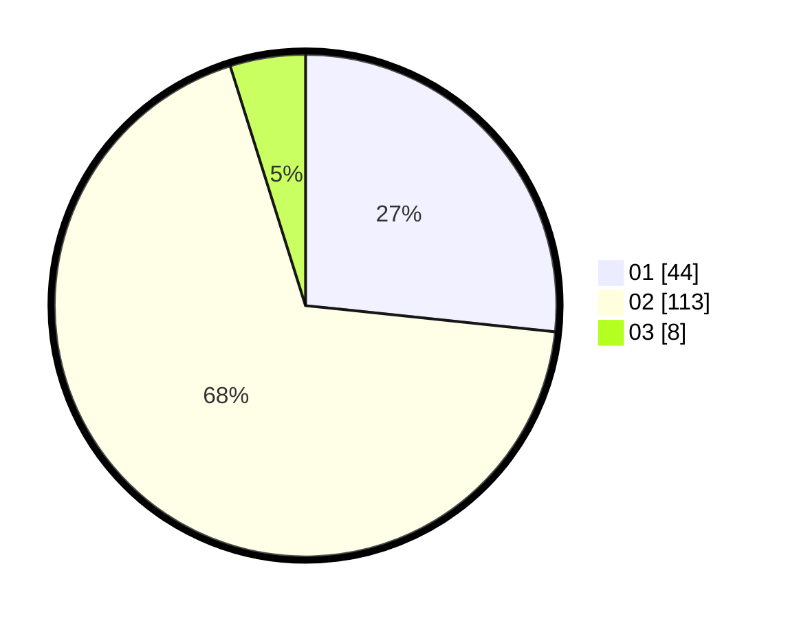

# Hasil

Hasil perolehan suara paslon dapat dilihat pada file paslon-01.txt, paslon-02.txt, dan paslon-03.txt.

Jika tidak ada, artinya data tersebut belum ada pada SIREKAP.

## Perolehan Suara

 * Paslon 01: **44**.
 * Paslon 02: **113**.
 * Paslon 03: **8**.

## Foto C Plano

https://sirekap-obj-formc.kpu.go.id/aeb5/pemilu/ppwp/31/72/04/10/03/3172041003066-20240214-184944--e22460e4-d4ea-46aa-8444-93b12b9e4075.jpg

https://sirekap-obj-formc.kpu.go.id/aeb5/pemilu/ppwp/31/72/04/10/03/3172041003066-20240214-185001--c1f4242c-a3b5-4d75-b807-041c6f47b2e8.jpg

https://sirekap-obj-formc.kpu.go.id/aeb5/pemilu/ppwp/31/72/04/10/03/3172041003066-20240214-185006--fe6a8ecc-ab05-476e-b119-c18efa9c5a3e.jpg

## DATA PEMILIH TETAP

Jumlah pemilih dalam DPT: **164**.
 * L: **78**.
 * P: **86**.

## DATA PENGGUNA HAK PILIH

Jumlah pengguna hak pilih dalam DPT: **164**.
 * L: **78**.
 * P: **86**.

Jumlah pengguna hak pilih dalam DPTb: **3**.
 * L: **1**.
 * P: **2**.

Jumlah pengguna hak pilih dalam DPK: **0**.
 * L: **0**.
 * P: **0**.

Jumlah pengguna hak pilih: **167**.
 * L: **79**.
 * P: **88**.

## JUMLAH SUARA SAH DAN TIDAK SAH

JUMLAH SELURUH SUARA SAH: **165**.

JUMLAH SUARA TIDAK SAH: **2**.

JUMLAH SELURUH SUARA SAH DAN SUARA TIDAK SAH: **167**.
