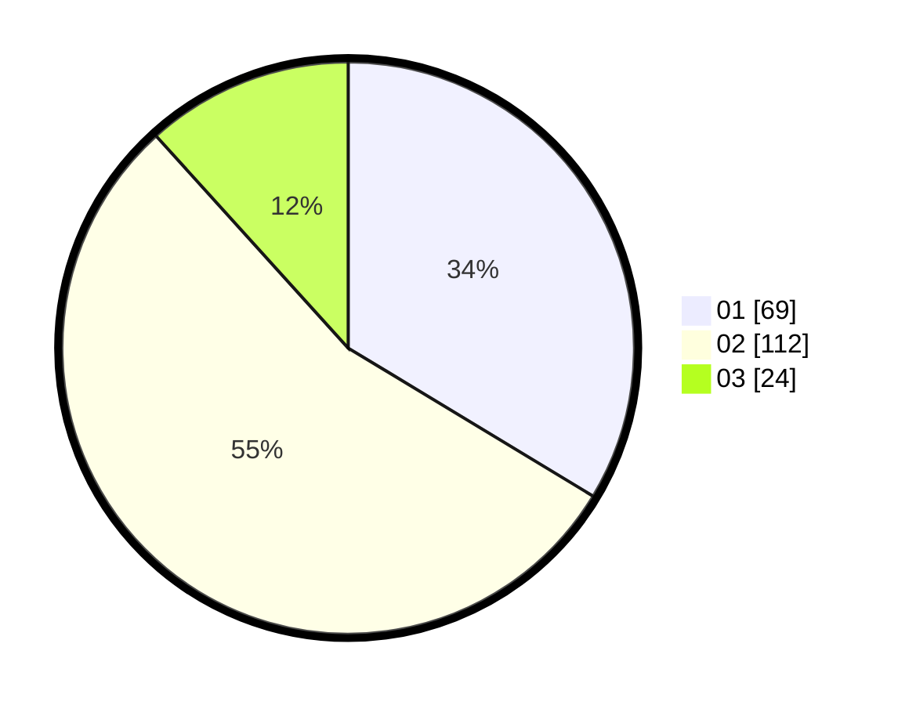

# Hasil

Hasil perolehan suara paslon dapat dilihat pada file paslon-01.txt, paslon-02.txt, dan paslon-03.txt.

Jika tidak ada, artinya data tersebut belum ada pada SIREKAP.

## Perolehan Suara

 * Paslon 01: **69**.
 * Paslon 02: **112**.
 * Paslon 03: **24**.

## Foto C Plano

https://sirekap-obj-formc.kpu.go.id/99fd/pemilu/ppwp/31/72/04/10/03/3172041003076-20240214-212126--2389726b-e6d1-41bc-9a50-fd5c2c17273c.jpg

https://sirekap-obj-formc.kpu.go.id/99fd/pemilu/ppwp/31/72/04/10/03/3172041003076-20240214-222539--f83fcf4e-5820-49a5-b14b-5633bf9768cd.jpg

https://sirekap-obj-formc.kpu.go.id/99fd/pemilu/ppwp/31/72/04/10/03/3172041003076-20240214-211536--253611db-6e24-4d0a-97c6-cd38ecf47055.jpg
