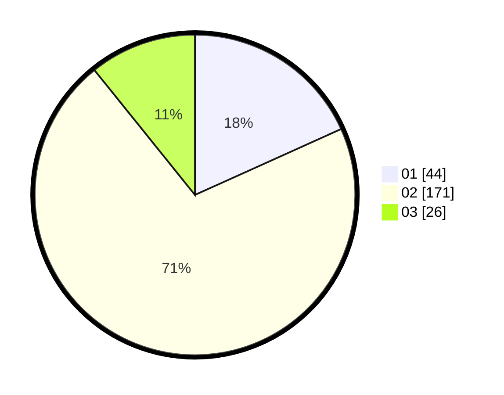

# Hasil

Hasil perolehan suara paslon dapat dilihat pada file paslon-01.txt, paslon-02.txt, dan paslon-03.txt.

Jika tidak ada, artinya data tersebut belum ada pada SIREKAP.

## Perolehan Suara

 * Paslon 01: **44**.
 * Paslon 02: **171**.
 * Paslon 03: **26**.

## Foto C Plano

https://sirekap-obj-formc.kpu.go.id/b550/pemilu/ppwp/31/72/04/10/03/3172041003077-20240214-215749--dc50c2da-73ec-4b11-ae94-bc206054c96e.jpg

https://sirekap-obj-formc.kpu.go.id/b550/pemilu/ppwp/31/72/04/10/03/3172041003077-20240214-220605--5e99f6a5-197f-4819-b0fb-b68fa25ef2ca.jpg

https://sirekap-obj-formc.kpu.go.id/b550/pemilu/ppwp/31/72/04/10/03/3172041003077-20240214-210811--273f6596-d8c4-43e4-92fd-eb905bd4d2cc.jpg

## DATA PEMILIH TETAP

Jumlah pemilih dalam DPT: **292**.
 * L: **143**.
 * P: **149**.

## DATA PENGGUNA HAK PILIH

Jumlah pengguna hak pilih dalam DPT: **243**.
 * L: **117**.
 * P: **126**.

Jumlah pengguna hak pilih dalam DPTb: **0**.
 * L: **0**.
 * P: **0**.

Jumlah pengguna hak pilih dalam DPK: **1**.
 * L: **1**.
 * P: **0**.

Jumlah pengguna hak pilih: **244**.
 * L: **118**.
 * P: **126**.

## JUMLAH SUARA SAH DAN TIDAK SAH

JUMLAH SELURUH SUARA SAH: **241**.

JUMLAH SUARA TIDAK SAH: **3**.

JUMLAH SELURUH SUARA SAH DAN SUARA TIDAK SAH: **244**.
