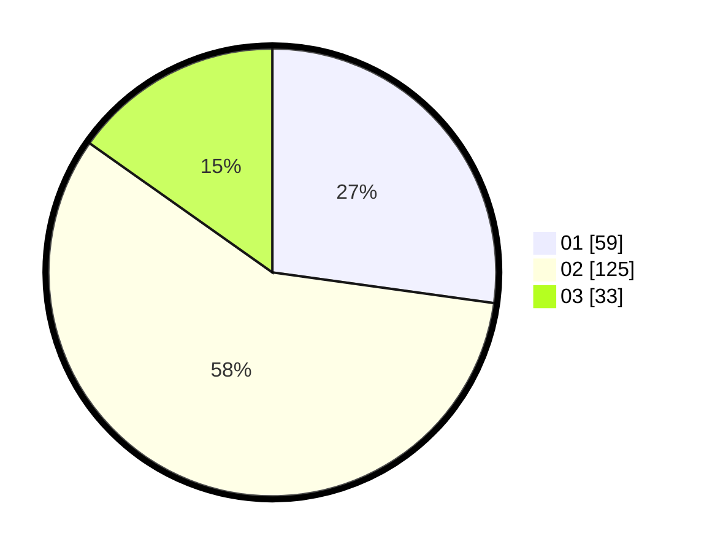

# Hasil

Hasil perolehan suara paslon dapat dilihat pada file paslon-01.txt, paslon-02.txt, dan paslon-03.txt.

Jika tidak ada, artinya data tersebut belum ada pada SIREKAP.

## Perolehan Suara

 * Paslon 01: **59**.
 * Paslon 02: **125**.
 * Paslon 03: **33**.

## Foto C Plano

https://sirekap-obj-formc.kpu.go.id/d458/pemilu/ppwp/31/72/04/10/03/3172041003079-20240215-174124--8b8bc4b7-2677-4466-9c33-2c4897c09ceb.jpg

https://sirekap-obj-formc.kpu.go.id/d458/pemilu/ppwp/31/72/04/10/03/3172041003079-20240214-222305--33daa8eb-ef73-426d-9059-21477cd2385c.jpg

https://sirekap-obj-formc.kpu.go.id/d458/pemilu/ppwp/31/72/04/10/03/3172041003079-20240214-222424--bc16ff71-ccae-45f6-9cef-019625d44c6b.jpg

## DATA PEMILIH TETAP

Jumlah pemilih dalam DPT: **279**.
 * L: **141**.
 * P: **138**.

## DATA PENGGUNA HAK PILIH

Jumlah pengguna hak pilih dalam DPT: **216**.
 * L: **101**.
 * P: **115**.

Jumlah pengguna hak pilih dalam DPTb: **0**.
 * L: **0**.
 * P: **0**.

Jumlah pengguna hak pilih dalam DPK: **5**.
 * L: **3**.
 * P: **2**.

Jumlah pengguna hak pilih: **221**.
 * L: **104**.
 * P: **117**.

## JUMLAH SUARA SAH DAN TIDAK SAH

JUMLAH SELURUH SUARA SAH: **217**.

JUMLAH SUARA TIDAK SAH: **4**.

JUMLAH SELURUH SUARA SAH DAN SUARA TIDAK SAH: **221**.
