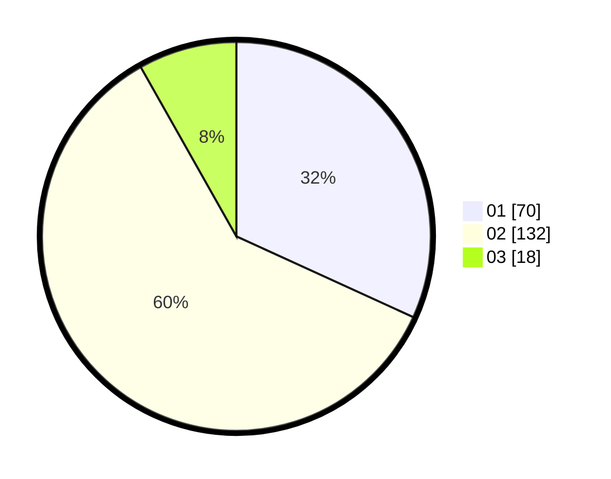

# Hasil

Hasil perolehan suara paslon dapat dilihat pada file paslon-01.txt, paslon-02.txt, dan paslon-03.txt.

Jika tidak ada, artinya data tersebut belum ada pada SIREKAP.

## Perolehan Suara

 * Paslon 01: **70**.
 * Paslon 02: **132**.
 * Paslon 03: **18**.

## Foto C Plano

https://sirekap-obj-formc.kpu.go.id/faae/pemilu/ppwp/31/72/04/10/03/3172041003082-20240216-002004--d5269fd6-3a5d-454f-ad31-54adfc107989.jpg

https://sirekap-obj-formc.kpu.go.id/faae/pemilu/ppwp/31/72/04/10/03/3172041003082-20240214-155014--db1e8b84-deff-4c82-abc7-5493b8b2bfbe.jpg

https://sirekap-obj-formc.kpu.go.id/faae/pemilu/ppwp/31/72/04/10/03/3172041003082-20240214-155703--31b577cd-1481-4053-953d-f1fd1107131b.jpg

## DATA PEMILIH TETAP

Jumlah pemilih dalam DPT: **0**.
 * L: **0**.
 * P: **0**.

## DATA PENGGUNA HAK PILIH

Jumlah pengguna hak pilih dalam DPT: **0**.
 * L: **0**.
 * P: **0**.

Jumlah pengguna hak pilih dalam DPTb: **0**.
 * L: **0**.
 * P: **0**.

Jumlah pengguna hak pilih dalam DPK: **0**.
 * L: **0**.
 * P: **0**.

Jumlah pengguna hak pilih: **0**.
 * L: **0**.
 * P: **0**.

## JUMLAH SUARA SAH DAN TIDAK SAH

JUMLAH SELURUH SUARA SAH: **220**.

JUMLAH SUARA TIDAK SAH: **8**.

JUMLAH SELURUH SUARA SAH DAN SUARA TIDAK SAH: **228**.
