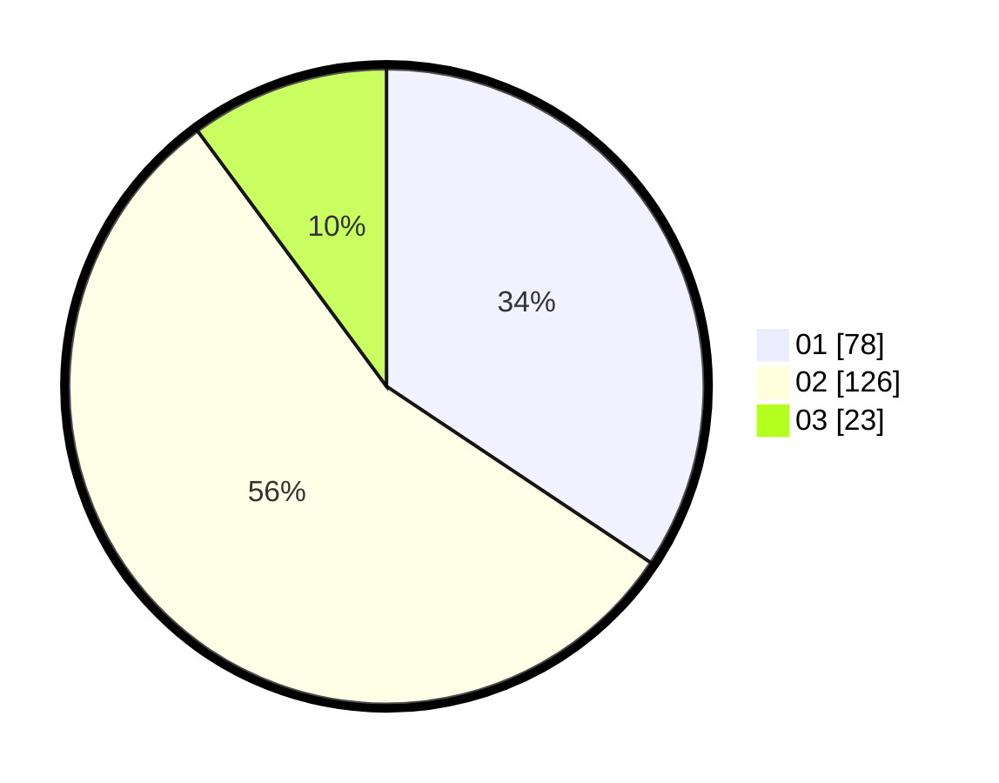

# Hasil

Hasil perolehan suara paslon dapat dilihat pada file paslon-01.txt, paslon-02.txt, dan paslon-03.txt.

Jika tidak ada, artinya data tersebut belum ada pada SIREKAP.

## Perolehan Suara

 * Paslon 01: **78**.
 * Paslon 02: **126**.
 * Paslon 03: **23**.

## Foto C Plano

https://sirekap-obj-formc.kpu.go.id/14e5/pemilu/ppwp/31/72/04/10/03/3172041003084-20240214-195800--67255863-5715-418a-8e4c-aa2446b8f5b7.jpg

https://sirekap-obj-formc.kpu.go.id/14e5/pemilu/ppwp/31/72/04/10/03/3172041003084-20240214-224747--9ad4b3ad-6dcc-448c-8a75-d3c29f96a184.jpg

https://sirekap-obj-formc.kpu.go.id/14e5/pemilu/ppwp/31/72/04/10/03/3172041003084-20240214-224732--e238c46f-7b8e-4ee6-b8e9-399d0a8c7f08.jpg

## DATA PEMILIH TETAP

Jumlah pemilih dalam DPT: **284**.
 * L: **147**.
 * P: **137**.

## DATA PENGGUNA HAK PILIH

Jumlah pengguna hak pilih dalam DPT: **228**.
 * L: **116**.
 * P: **112**.

Jumlah pengguna hak pilih dalam DPTb: **1**.
 * L: **1**.
 * P: **0**.

Jumlah pengguna hak pilih dalam DPK: **0**.
 * L: **0**.
 * P: **0**.

Jumlah pengguna hak pilih: **229**.
 * L: **117**.
 * P: **112**.

## JUMLAH SUARA SAH DAN TIDAK SAH

JUMLAH SELURUH SUARA SAH: **227**.

JUMLAH SUARA TIDAK SAH: **2**.

JUMLAH SELURUH SUARA SAH DAN SUARA TIDAK SAH: **229**.
