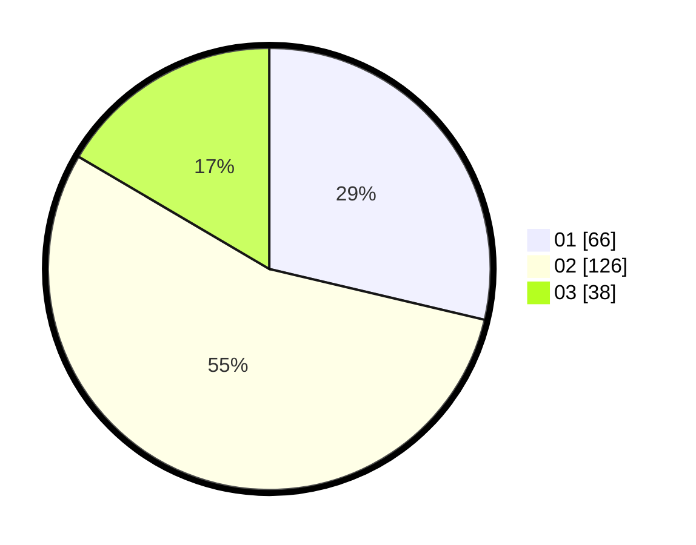

# Hasil

Hasil perolehan suara paslon dapat dilihat pada file paslon-01.txt, paslon-02.txt, dan paslon-03.txt.

Jika tidak ada, artinya data tersebut belum ada pada SIREKAP.

## Perolehan Suara

 * Paslon 01: **66**.
 * Paslon 02: **126**.
 * Paslon 03: **38**.

## Foto C Plano

https://sirekap-obj-formc.kpu.go.id/3924/pemilu/ppwp/31/72/04/10/03/3172041003093-20240215-021957--15ea2860-e059-459f-91da-6889d8379bac.jpg

https://sirekap-obj-formc.kpu.go.id/3924/pemilu/ppwp/31/72/04/10/03/3172041003093-20240215-022307--b6542848-9119-4132-846d-5e5f529f87ec.jpg

https://sirekap-obj-formc.kpu.go.id/3924/pemilu/ppwp/31/72/04/10/03/3172041003093-20240215-022534--23943f4a-8be7-49c0-b9be-585bac1a226f.jpg

## DATA PEMILIH TETAP

Jumlah pemilih dalam DPT: **284**.
 * L: **139**.
 * P: **145**.

## DATA PENGGUNA HAK PILIH

Jumlah pengguna hak pilih dalam DPT: **227**.
 * L: **110**.
 * P: **117**.

Jumlah pengguna hak pilih dalam DPTb: **1**.
 * L: **0**.
 * P: **1**.

Jumlah pengguna hak pilih dalam DPK: **3**.
 * L: **1**.
 * P: **2**.

Jumlah pengguna hak pilih: **231**.
 * L: **111**.
 * P: **120**.

## JUMLAH SUARA SAH DAN TIDAK SAH

JUMLAH SELURUH SUARA SAH: **230**.

JUMLAH SUARA TIDAK SAH: **1**.

JUMLAH SELURUH SUARA SAH DAN SUARA TIDAK SAH: **231**.
