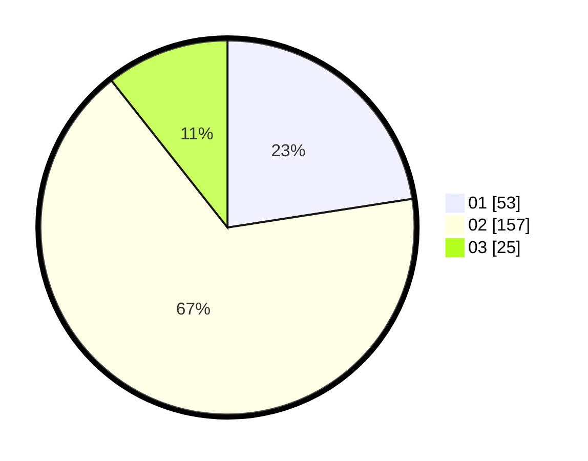

# Hasil

Hasil perolehan suara paslon dapat dilihat pada file paslon-01.txt, paslon-02.txt, dan paslon-03.txt.

Jika tidak ada, artinya data tersebut belum ada pada SIREKAP.

## Perolehan Suara

 * Paslon 01: **53**.
 * Paslon 02: **157**.
 * Paslon 03: **25**.

## Foto C Plano

https://sirekap-obj-formc.kpu.go.id/4ea1/pemilu/ppwp/31/72/04/10/04/3172041004011-20240214-192507--c7b74f95-b09b-4da5-b1cd-5eab036c89ca.jpg

https://sirekap-obj-formc.kpu.go.id/4ea1/pemilu/ppwp/31/72/04/10/04/3172041004011-20240214-192624--33548067-a172-4ca7-81fe-14a886fb72dc.jpg

https://sirekap-obj-formc.kpu.go.id/4ea1/pemilu/ppwp/31/72/04/10/04/3172041004011-20240214-192708--cec5a69c-c40b-4f9f-b98c-51c9d3f98f6c.jpg

## DATA PEMILIH TETAP

Jumlah pemilih dalam DPT: **286**.
 * L: **141**.
 * P: **145**.

## DATA PENGGUNA HAK PILIH

Jumlah pengguna hak pilih dalam DPT: **239**.
 * L: **121**.
 * P: **118**.

Jumlah pengguna hak pilih dalam DPTb: **1**.
 * L: **1**.
 * P: **0**.

Jumlah pengguna hak pilih dalam DPK: **0**.
 * L: **0**.
 * P: **0**.

Jumlah pengguna hak pilih: **240**.
 * L: **122**.
 * P: **118**.

## JUMLAH SUARA SAH DAN TIDAK SAH

JUMLAH SELURUH SUARA SAH: **235**.

JUMLAH SUARA TIDAK SAH: **5**.

JUMLAH SELURUH SUARA SAH DAN SUARA TIDAK SAH: **240**.
