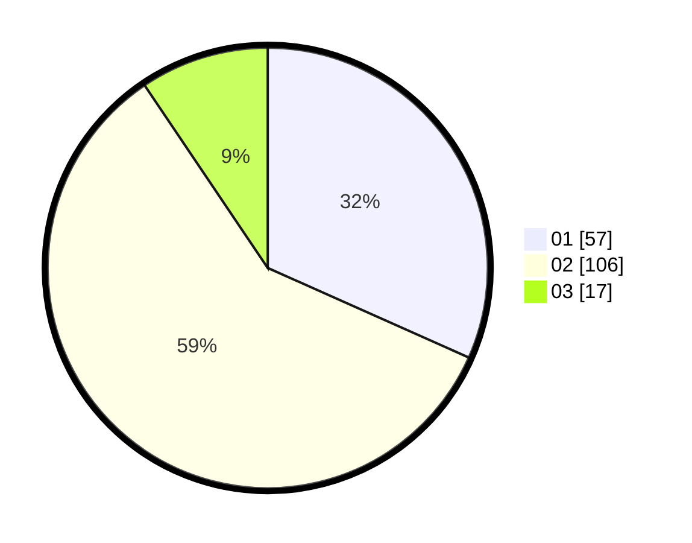

# Hasil

Hasil perolehan suara paslon dapat dilihat pada file paslon-01.txt, paslon-02.txt, dan paslon-03.txt.

Jika tidak ada, artinya data tersebut belum ada pada SIREKAP.

## Perolehan Suara

 * Paslon 01: **57**.
 * Paslon 02: **106**.
 * Paslon 03: **17**.

## Foto C Plano

https://sirekap-obj-formc.kpu.go.id/1f2e/pemilu/ppwp/31/72/04/10/04/3172041004036-20240214-195422--3cfdfd8a-f105-4a87-a0dd-d36420d7fce5.jpg

https://sirekap-obj-formc.kpu.go.id/1f2e/pemilu/ppwp/31/72/04/10/04/3172041004036-20240214-201343--701895bc-5f5f-42b5-a8db-5bc65be8a431.jpg

https://sirekap-obj-formc.kpu.go.id/1f2e/pemilu/ppwp/31/72/04/10/04/3172041004036-20240214-210117--560f885d-eb1a-4ffd-924c-902ffbe5007a.jpg
