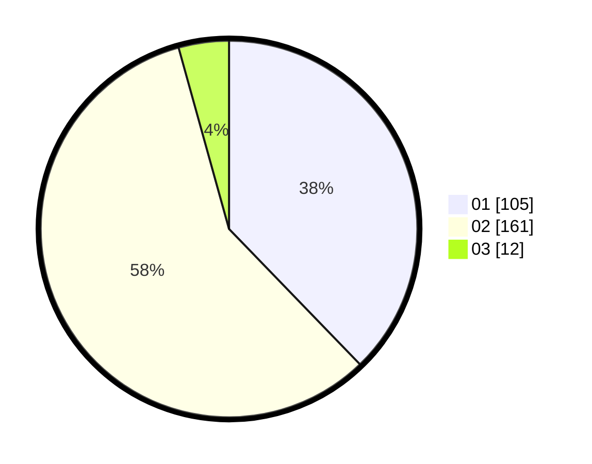

# Hasil

Hasil perolehan suara paslon dapat dilihat pada file paslon-01.txt, paslon-02.txt, dan paslon-03.txt.

Jika tidak ada, artinya data tersebut belum ada pada SIREKAP.

## Perolehan Suara

 * Paslon 01: **105**.
 * Paslon 02: **161**.
 * Paslon 03: **12**.

## Foto C Plano

https://sirekap-obj-formc.kpu.go.id/9baa/pemilu/ppwp/31/72/04/10/04/3172041004053-20240214-155440--bbbf4770-c0ea-4aa9-b08c-7bdcce1a6ee1.jpg

https://sirekap-obj-formc.kpu.go.id/9baa/pemilu/ppwp/31/72/04/10/04/3172041004053-20240214-155633--a74aec0f-4d42-4157-acf5-6cecd034fa88.jpg

https://sirekap-obj-formc.kpu.go.id/9baa/pemilu/ppwp/31/72/04/10/04/3172041004053-20240214-194146--f5ae8191-0381-484f-9e17-e4466a2fdf39.jpg
