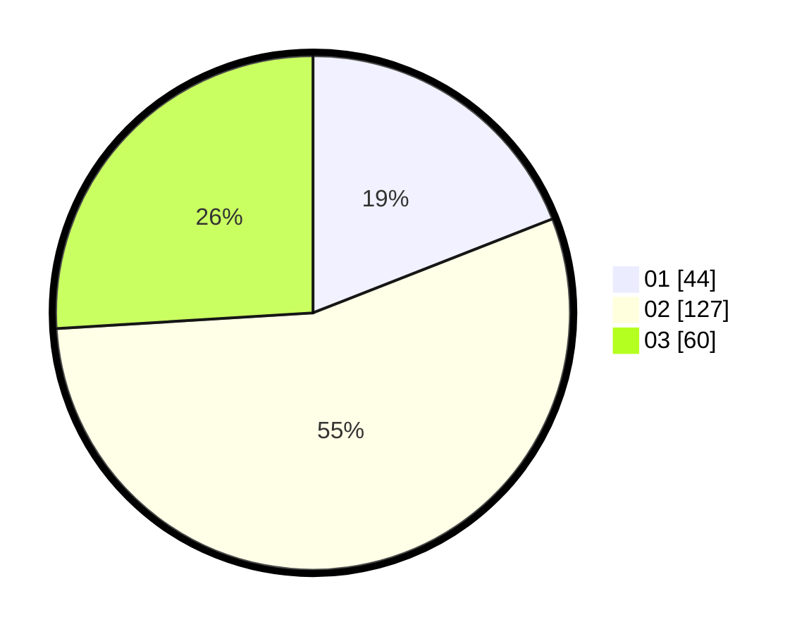

# Hasil

Hasil perolehan suara paslon dapat dilihat pada file paslon-01.txt, paslon-02.txt, dan paslon-03.txt.

Jika tidak ada, artinya data tersebut belum ada pada SIREKAP.

## Perolehan Suara

 * Paslon 01: **44**.
 * Paslon 02: **127**.
 * Paslon 03: **60**.

## Foto C Plano

https://sirekap-obj-formc.kpu.go.id/94db/pemilu/ppwp/31/72/04/10/04/3172041004062-20240214-185411--b074a4d7-fa11-4a3c-9149-b5df7d18878c.jpg

https://sirekap-obj-formc.kpu.go.id/94db/pemilu/ppwp/31/72/04/10/04/3172041004062-20240214-185433--2baa4213-743a-4b32-8dae-a22f84d1dae6.jpg

https://sirekap-obj-formc.kpu.go.id/94db/pemilu/ppwp/31/72/04/10/04/3172041004062-20240214-185457--4533783d-b08c-4c4a-ad9b-df327f9b4adc.jpg

## DATA PEMILIH TETAP

Jumlah pemilih dalam DPT: **292**.
 * L: **142**.
 * P: **150**.

## DATA PENGGUNA HAK PILIH

Jumlah pengguna hak pilih dalam DPT: **230**.
 * L: **114**.
 * P: **116**.

Jumlah pengguna hak pilih dalam DPTb: **0**.
 * L: **0**.
 * P: **0**.

Jumlah pengguna hak pilih dalam DPK: **4**.
 * L: **1**.
 * P: **3**.

Jumlah pengguna hak pilih: **234**.
 * L: **115**.
 * P: **119**.

## JUMLAH SUARA SAH DAN TIDAK SAH

JUMLAH SELURUH SUARA SAH: **228**.

JUMLAH SUARA TIDAK SAH: **6**.

JUMLAH SELURUH SUARA SAH DAN SUARA TIDAK SAH: **234**.
