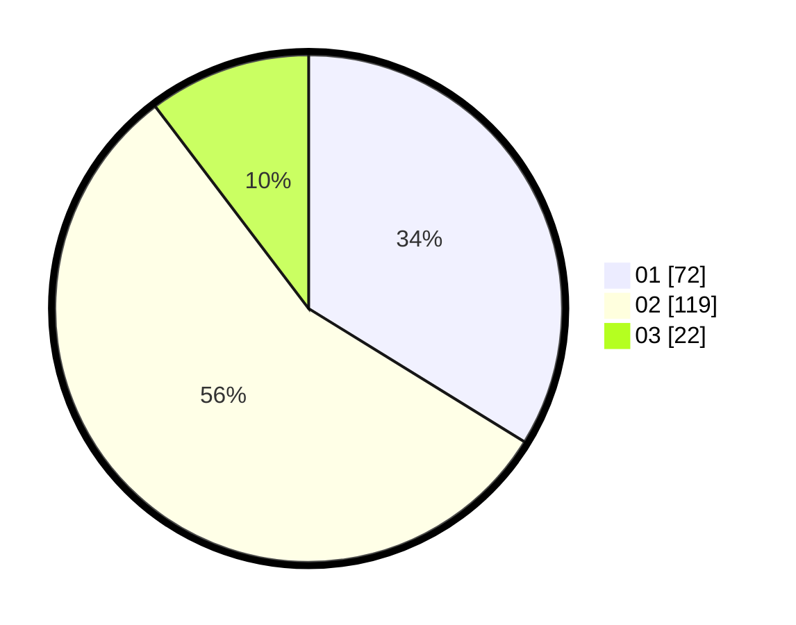

# Hasil

Hasil perolehan suara paslon dapat dilihat pada file paslon-01.txt, paslon-02.txt, dan paslon-03.txt.

Jika tidak ada, artinya data tersebut belum ada pada SIREKAP.

## Perolehan Suara

 * Paslon 01: **72**.
 * Paslon 02: **119**.
 * Paslon 03: **22**.

## Foto C Plano

https://sirekap-obj-formc.kpu.go.id/615a/pemilu/ppwp/31/72/04/10/04/3172041004093-20240214-194625--11520753-6b08-45a9-bc7b-4b43b344aabd.jpg

https://sirekap-obj-formc.kpu.go.id/615a/pemilu/ppwp/31/72/04/10/04/3172041004093-20240214-194909--2f92b1dc-2476-40d4-b27f-5e3804efae46.jpg

https://sirekap-obj-formc.kpu.go.id/615a/pemilu/ppwp/31/72/04/10/04/3172041004093-20240214-195007--058d667c-cb84-474b-afa6-e37694f7fa7b.jpg

## DATA PEMILIH TETAP

Jumlah pemilih dalam DPT: **287**.
 * L: **141**.
 * P: **146**.

## DATA PENGGUNA HAK PILIH

Jumlah pengguna hak pilih dalam DPT: **209**.
 * L: **94**.
 * P: **115**.

Jumlah pengguna hak pilih dalam DPTb: **3**.
 * L: **3**.
 * P: **0**.

Jumlah pengguna hak pilih dalam DPK: **6**.
 * L: **3**.
 * P: **3**.

Jumlah pengguna hak pilih: **218**.
 * L: **100**.
 * P: **118**.

## JUMLAH SUARA SAH DAN TIDAK SAH

JUMLAH SELURUH SUARA SAH: **213**.

JUMLAH SUARA TIDAK SAH: **5**.

JUMLAH SELURUH SUARA SAH DAN SUARA TIDAK SAH: **218**.
