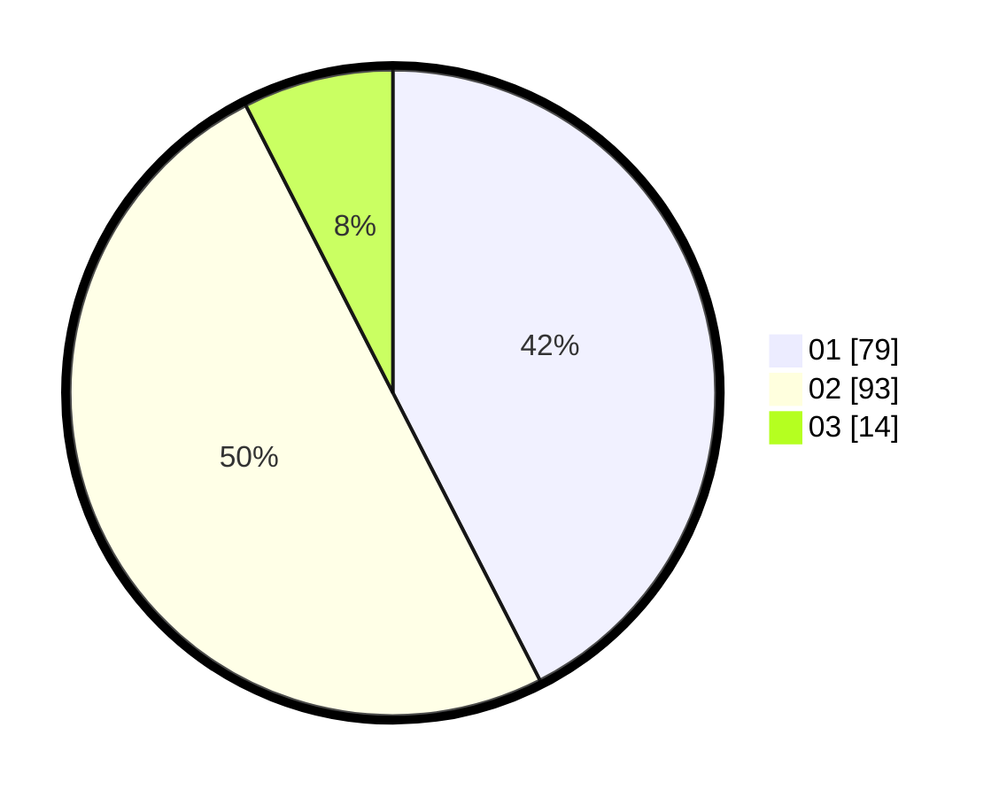

# Hasil

Hasil perolehan suara paslon dapat dilihat pada file paslon-01.txt, paslon-02.txt, dan paslon-03.txt.

Jika tidak ada, artinya data tersebut belum ada pada SIREKAP.

## Perolehan Suara

 * Paslon 01: **79**.
 * Paslon 02: **93**.
 * Paslon 03: **14**.

## Foto C Plano

https://sirekap-obj-formc.kpu.go.id/0639/pemilu/ppwp/31/72/04/10/04/3172041004104-20240214-204143--67376481-eb6f-4744-9fbd-2383426672ba.jpg

https://sirekap-obj-formc.kpu.go.id/0639/pemilu/ppwp/31/72/04/10/04/3172041004104-20240214-214633--87b57c35-b0d2-4d5e-b0a5-a4c59ce7f344.jpg

https://sirekap-obj-formc.kpu.go.id/0639/pemilu/ppwp/31/72/04/10/04/3172041004104-20240214-214451--9e85d9bb-e6e9-4f70-80f9-67aad7f4c3cd.jpg

## DATA PEMILIH TETAP

Jumlah pemilih dalam DPT: **185**.
 * L: **80**.
 * P: **105**.

## DATA PENGGUNA HAK PILIH

Jumlah pengguna hak pilih dalam DPT: **185**.
 * L: **80**.
 * P: **105**.

Jumlah pengguna hak pilih dalam DPTb: **1**.
 * L: **1**.
 * P: **0**.

Jumlah pengguna hak pilih dalam DPK: **1**.
 * L: **1**.
 * P: **0**.

Jumlah pengguna hak pilih: **187**.
 * L: **82**.
 * P: **105**.

## JUMLAH SUARA SAH DAN TIDAK SAH

JUMLAH SELURUH SUARA SAH: **186**.

JUMLAH SUARA TIDAK SAH: **1**.

JUMLAH SELURUH SUARA SAH DAN SUARA TIDAK SAH: **187**.
