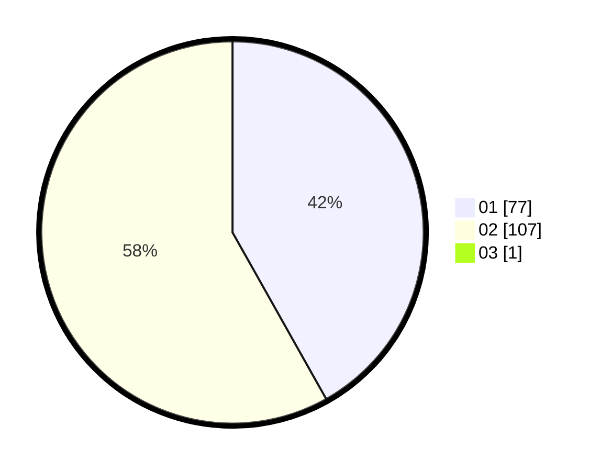

# Hasil

Hasil perolehan suara paslon dapat dilihat pada file paslon-01.txt, paslon-02.txt, dan paslon-03.txt.

Jika tidak ada, artinya data tersebut belum ada pada SIREKAP.

## Perolehan Suara

 * Paslon 01: **77**.
 * Paslon 02: **107**.
 * Paslon 03: **1**.

## Foto C Plano

https://sirekap-obj-formc.kpu.go.id/c796/pemilu/ppwp/31/72/04/10/04/3172041004114-20240214-185226--1fa85bf5-9570-49ea-b035-6a316deeef49.jpg

https://sirekap-obj-formc.kpu.go.id/c796/pemilu/ppwp/31/72/04/10/04/3172041004114-20240214-185502--d5338ce7-f65c-4ea4-a997-e0cd71be0096.jpg

https://sirekap-obj-formc.kpu.go.id/c796/pemilu/ppwp/31/72/04/10/04/3172041004114-20240214-185559--9e7a02de-ae70-4a24-8cb7-f7312e4d140d.jpg

## DATA PEMILIH TETAP

Jumlah pemilih dalam DPT: **276**.
 * L: **138**.
 * P: **138**.

## DATA PENGGUNA HAK PILIH

Jumlah pengguna hak pilih dalam DPT: **192**.
 * L: **89**.
 * P: **103**.

Jumlah pengguna hak pilih dalam DPTb: **0**.
 * L: **0**.
 * P: **0**.

Jumlah pengguna hak pilih dalam DPK: **9**.
 * L: **7**.
 * P: **2**.

Jumlah pengguna hak pilih: **192**.
 * L: **89**.
 * P: **103**.

## JUMLAH SUARA SAH DAN TIDAK SAH

JUMLAH SELURUH SUARA SAH: **195**.

JUMLAH SUARA TIDAK SAH: **6**.

JUMLAH SELURUH SUARA SAH DAN SUARA TIDAK SAH: **201**.
