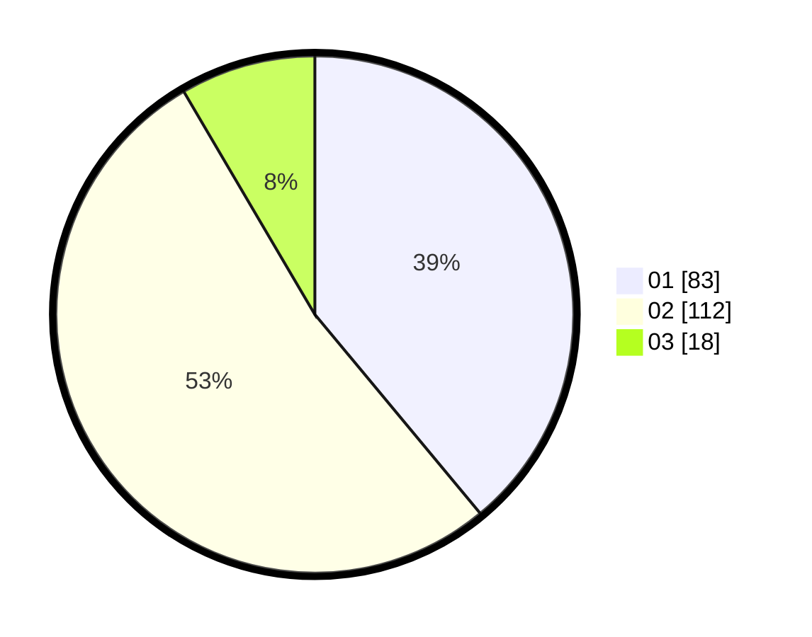

# Hasil

Hasil perolehan suara paslon dapat dilihat pada file paslon-01.txt, paslon-02.txt, dan paslon-03.txt.

Jika tidak ada, artinya data tersebut belum ada pada SIREKAP.

## Perolehan Suara

 * Paslon 01: **83**.
 * Paslon 02: **112**.
 * Paslon 03: **18**.

## Foto C Plano

https://sirekap-obj-formc.kpu.go.id/1a5c/pemilu/ppwp/31/72/04/10/04/3172041004115-20240214-185223--26751ca5-df90-446a-9814-1039a5261bce.jpg

https://sirekap-obj-formc.kpu.go.id/1a5c/pemilu/ppwp/31/72/04/10/04/3172041004115-20240214-185121--976a0cda-734d-48e4-ab96-e0694d7b250a.jpg

https://sirekap-obj-formc.kpu.go.id/1a5c/pemilu/ppwp/31/72/04/10/04/3172041004115-20240214-185352--ddf0df50-2304-4376-9459-ad1bbfd297a4.jpg

## DATA PEMILIH TETAP

Jumlah pemilih dalam DPT: **292**.
 * L: **147**.
 * P: **145**.

## DATA PENGGUNA HAK PILIH

Jumlah pengguna hak pilih dalam DPT: **207**.
 * L: **97**.
 * P: **110**.

Jumlah pengguna hak pilih dalam DPTb: **6**.
 * L: **5**.
 * P: **1**.

Jumlah pengguna hak pilih dalam DPK: **5**.
 * L: **3**.
 * P: **2**.

Jumlah pengguna hak pilih: **218**.
 * L: **105**.
 * P: **113**.

## JUMLAH SUARA SAH DAN TIDAK SAH

JUMLAH SELURUH SUARA SAH: **213**.

JUMLAH SUARA TIDAK SAH: **5**.

JUMLAH SELURUH SUARA SAH DAN SUARA TIDAK SAH: **218**.
