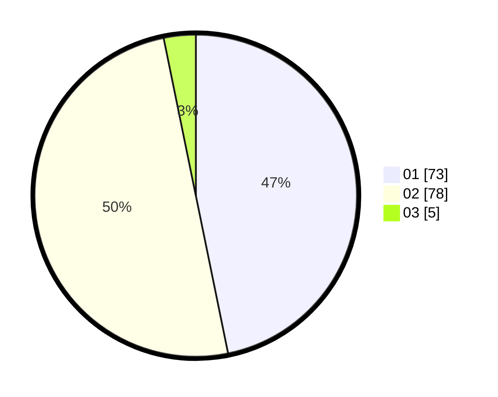

# Hasil

Hasil perolehan suara paslon dapat dilihat pada file paslon-01.txt, paslon-02.txt, dan paslon-03.txt.

Jika tidak ada, artinya data tersebut belum ada pada SIREKAP.

## Perolehan Suara

 * Paslon 01: **73**.
 * Paslon 02: **78**.
 * Paslon 03: **5**.

## Foto C Plano

https://sirekap-obj-formc.kpu.go.id/a827/pemilu/ppwp/31/72/04/10/04/3172041004127-20240214-200529--a85a57f6-1899-45d9-a5f3-9dc42ee92388.jpg

https://sirekap-obj-formc.kpu.go.id/a827/pemilu/ppwp/31/72/04/10/04/3172041004127-20240214-200627--ea961290-f2ce-40b3-b68c-df63451a7f0b.jpg

https://sirekap-obj-formc.kpu.go.id/a827/pemilu/ppwp/31/72/04/10/04/3172041004127-20240214-200735--32362a64-de02-4c2e-9316-8498bfb246dd.jpg

## DATA PEMILIH TETAP

Jumlah pemilih dalam DPT: **241**.
 * L: **125**.
 * P: **116**.

## DATA PENGGUNA HAK PILIH

Jumlah pengguna hak pilih dalam DPT: **160**.
 * L: **84**.
 * P: **76**.

Jumlah pengguna hak pilih dalam DPTb: **1**.
 * L: **0**.
 * P: **1**.

Jumlah pengguna hak pilih dalam DPK: **0**.
 * L: **0**.
 * P: **0**.

Jumlah pengguna hak pilih: **161**.
 * L: **84**.
 * P: **77**.

## JUMLAH SUARA SAH DAN TIDAK SAH

JUMLAH SELURUH SUARA SAH: **156**.

JUMLAH SUARA TIDAK SAH: **5**.

JUMLAH SELURUH SUARA SAH DAN SUARA TIDAK SAH: **161**.
