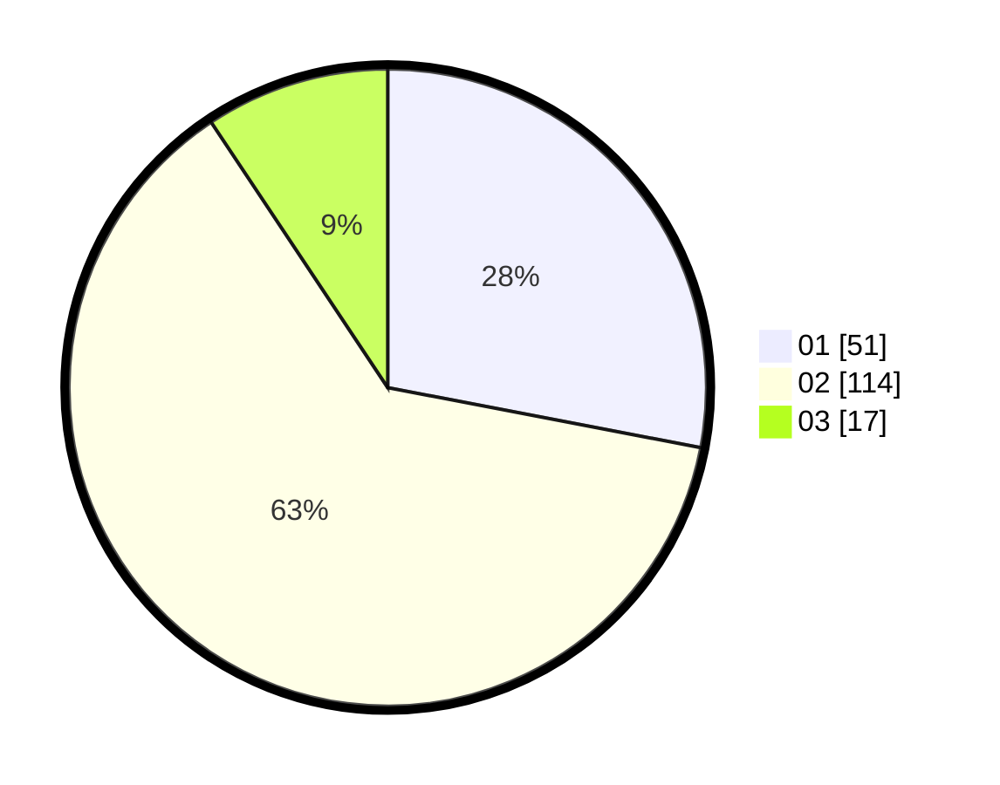

# Hasil

Hasil perolehan suara paslon dapat dilihat pada file paslon-01.txt, paslon-02.txt, dan paslon-03.txt.

Jika tidak ada, artinya data tersebut belum ada pada SIREKAP.

## Perolehan Suara

 * Paslon 01: **51**.
 * Paslon 02: **114**.
 * Paslon 03: **17**.

## Foto C Plano

https://sirekap-obj-formc.kpu.go.id/b643/pemilu/ppwp/31/72/04/10/04/3172041004129-20240214-155524--e7b75378-ef24-4c45-9c10-b9e9ef2a3777.jpg

https://sirekap-obj-formc.kpu.go.id/b643/pemilu/ppwp/31/72/04/10/04/3172041004129-20240214-155635--618c52de-6ba7-4446-b168-2ecbd0998fdf.jpg

https://sirekap-obj-formc.kpu.go.id/b643/pemilu/ppwp/31/72/04/10/04/3172041004129-20240214-155732--15bdac21-98d6-47e5-83b8-4e917bb43301.jpg
