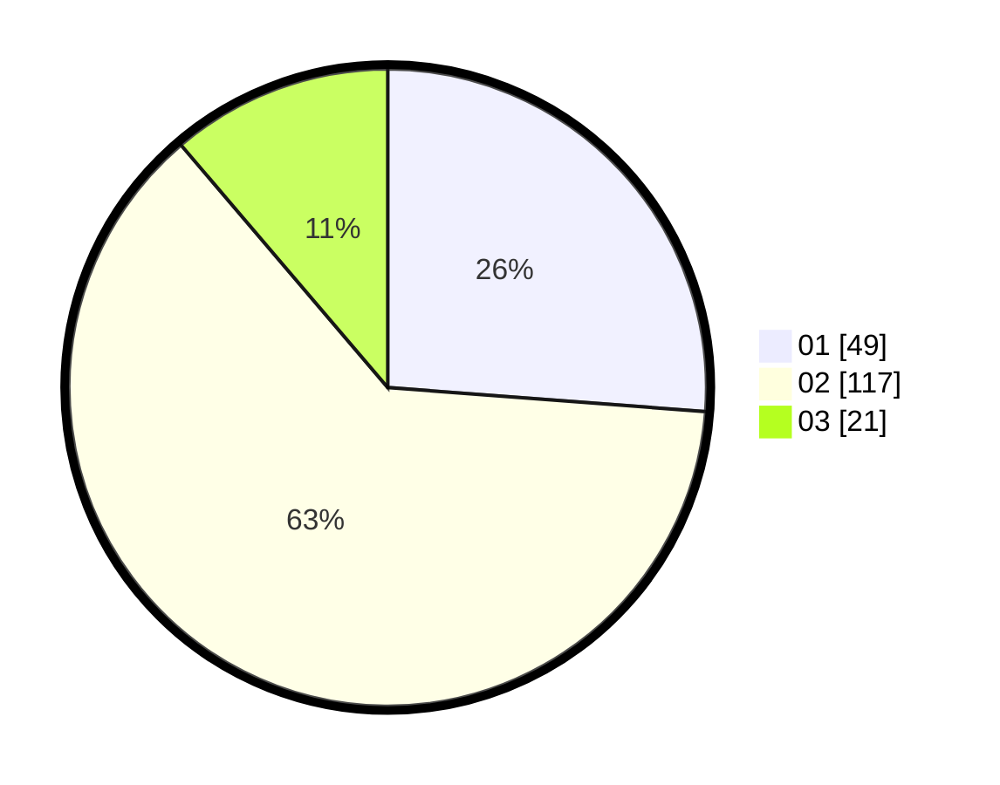

# Hasil

Hasil perolehan suara paslon dapat dilihat pada file paslon-01.txt, paslon-02.txt, dan paslon-03.txt.

Jika tidak ada, artinya data tersebut belum ada pada SIREKAP.

## Perolehan Suara

 * Paslon 01: **49**.
 * Paslon 02: **117**.
 * Paslon 03: **21**.

## Foto C Plano

https://sirekap-obj-formc.kpu.go.id/6b37/pemilu/ppwp/31/72/04/10/04/3172041004166-20240215-231851--aa7b49e6-a964-4c3f-a1c0-7d584e6194c7.jpg

https://sirekap-obj-formc.kpu.go.id/6b37/pemilu/ppwp/31/72/04/10/04/3172041004166-20240214-224437--06d7a1c5-b954-4ac5-9c46-d3a24f238d86.jpg

https://sirekap-obj-formc.kpu.go.id/6b37/pemilu/ppwp/31/72/04/10/04/3172041004166-20240214-155538--eb830107-50e9-4cc2-94ea-47ffdd48642b.jpg
