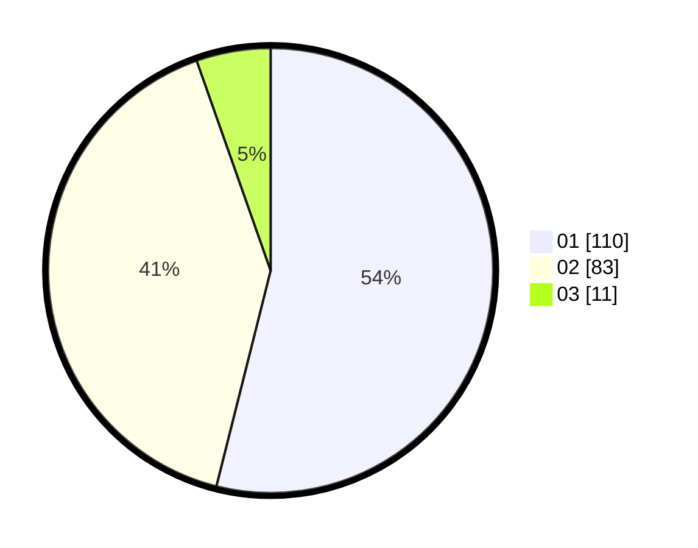

# Hasil

Hasil perolehan suara paslon dapat dilihat pada file paslon-01.txt, paslon-02.txt, dan paslon-03.txt.

Jika tidak ada, artinya data tersebut belum ada pada SIREKAP.

## Perolehan Suara

 * Paslon 01: **110**.
 * Paslon 02: **83**.
 * Paslon 03: **11**.

## Foto C Plano

https://sirekap-obj-formc.kpu.go.id/42b6/pemilu/ppwp/31/72/04/10/04/3172041004174-20240214-230919--e3dfe109-766f-4410-8df8-8b6d7f1e34df.jpg

https://sirekap-obj-formc.kpu.go.id/42b6/pemilu/ppwp/31/72/04/10/04/3172041004174-20240214-231754--0a070a17-96a9-4004-bdf5-a272a4368033.jpg

https://sirekap-obj-formc.kpu.go.id/42b6/pemilu/ppwp/31/72/04/10/04/3172041004174-20240214-231930--2c2b72af-0e1b-41ae-998f-c50a04efa317.jpg

## DATA PEMILIH TETAP

Jumlah pemilih dalam DPT: **292**.
 * L: **144**.
 * P: **148**.

## DATA PENGGUNA HAK PILIH

Jumlah pengguna hak pilih dalam DPT: **208**.
 * L: **101**.
 * P: **107**.

Jumlah pengguna hak pilih dalam DPTb: **805**.
 * L: **3**.
 * P: **2**.

Jumlah pengguna hak pilih dalam DPK: **0**.
 * L: **0**.
 * P: **0**.

Jumlah pengguna hak pilih: **213**.
 * L: **104**.
 * P: **109**.

## JUMLAH SUARA SAH DAN TIDAK SAH

JUMLAH SELURUH SUARA SAH: **204**.

JUMLAH SUARA TIDAK SAH: **9**.

JUMLAH SELURUH SUARA SAH DAN SUARA TIDAK SAH: **213**.
