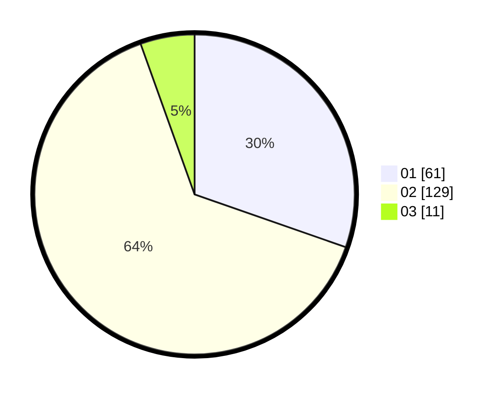

# Hasil

Hasil perolehan suara paslon dapat dilihat pada file paslon-01.txt, paslon-02.txt, dan paslon-03.txt.

Jika tidak ada, artinya data tersebut belum ada pada SIREKAP.

## Perolehan Suara

 * Paslon 01: **61**.
 * Paslon 02: **129**.
 * Paslon 03: **11**.

## Foto C Plano

https://sirekap-obj-formc.kpu.go.id/0471/pemilu/ppwp/31/72/04/10/04/3172041004181-20240214-235622--54c76ea0-28f5-4515-9c42-2f0c1b7cc92f.jpg

https://sirekap-obj-formc.kpu.go.id/0471/pemilu/ppwp/31/72/04/10/04/3172041004181-20240214-201241--833df816-6464-4848-b769-7b079c39270d.jpg

https://sirekap-obj-formc.kpu.go.id/0471/pemilu/ppwp/31/72/04/10/04/3172041004181-20240214-235747--fd117ffd-4535-4dfe-88e1-9cb6fa95f23d.jpg
