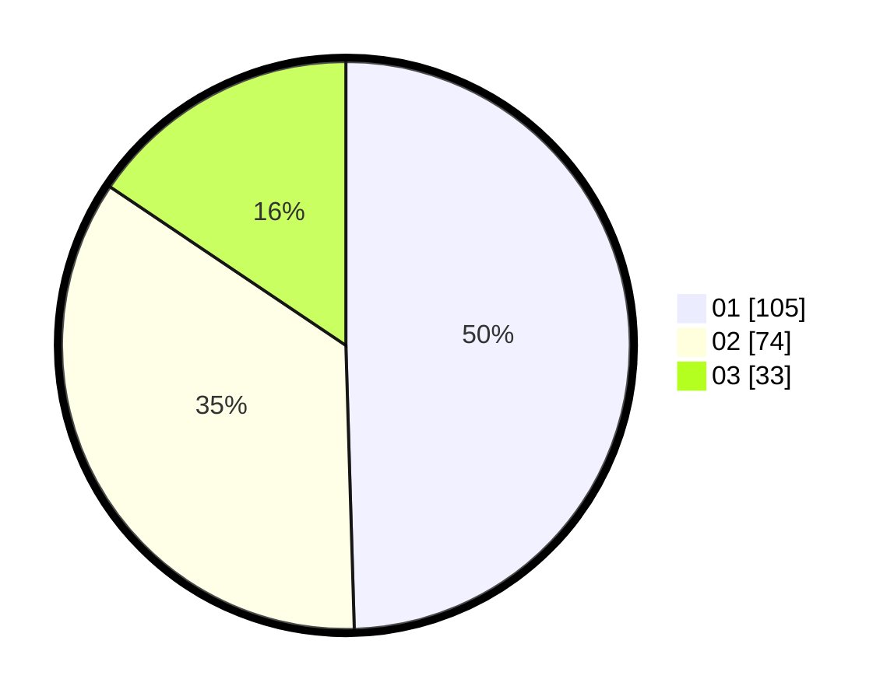

# Hasil

Hasil perolehan suara paslon dapat dilihat pada file paslon-01.txt, paslon-02.txt, dan paslon-03.txt.

Jika tidak ada, artinya data tersebut belum ada pada SIREKAP.

## Perolehan Suara

 * Paslon 01: **105**.
 * Paslon 02: **74**.
 * Paslon 03: **33**.

## Foto C Plano

https://sirekap-obj-formc.kpu.go.id/eb76/pemilu/ppwp/31/72/04/10/05/3172041005012-20240214-225227--fa43a825-62cf-4d40-bb31-24a62cd19828.jpg

https://sirekap-obj-formc.kpu.go.id/eb76/pemilu/ppwp/31/72/04/10/05/3172041005012-20240214-202050--6432ad6d-6688-4069-b122-c69f7e81c039.jpg

https://sirekap-obj-formc.kpu.go.id/eb76/pemilu/ppwp/31/72/04/10/05/3172041005012-20240215-045316--abdeaafb-9e62-412f-9952-817f407297c8.jpg
