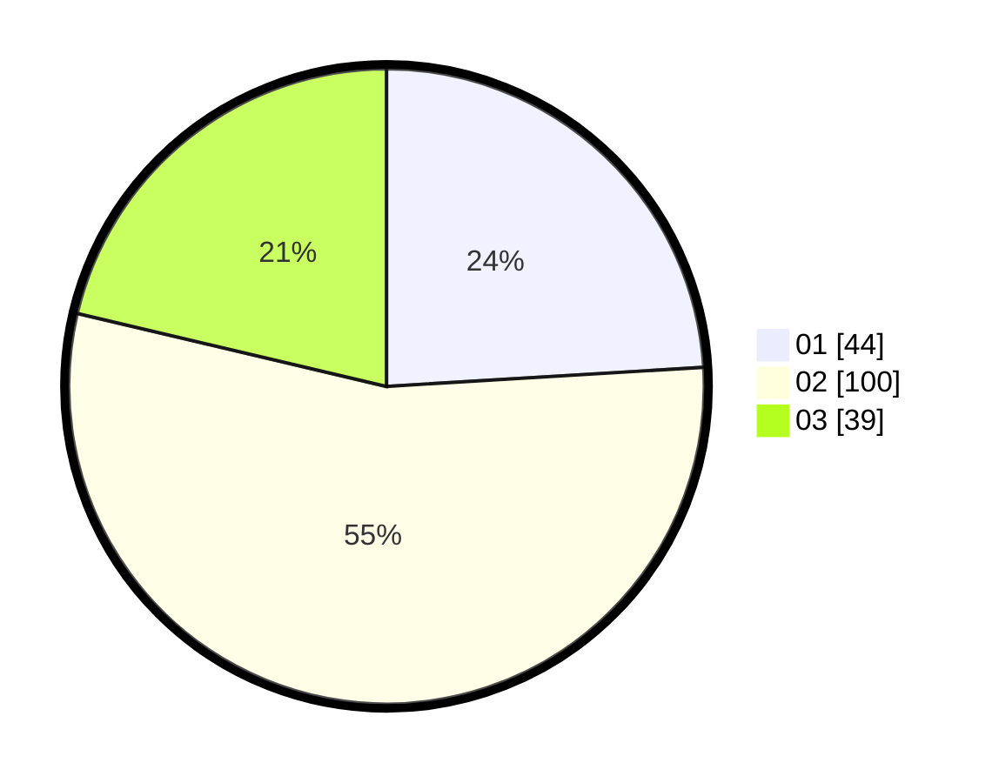

# Hasil

Hasil perolehan suara paslon dapat dilihat pada file paslon-01.txt, paslon-02.txt, dan paslon-03.txt.

Jika tidak ada, artinya data tersebut belum ada pada SIREKAP.

## Perolehan Suara

 * Paslon 01: **44**.
 * Paslon 02: **100**.
 * Paslon 03: **39**.

## Foto C Plano

https://sirekap-obj-formc.kpu.go.id/61b2/pemilu/ppwp/31/72/04/10/05/3172041005021-20240214-193345--45921dac-0578-4e23-82f7-1b8a06671d6f.jpg

https://sirekap-obj-formc.kpu.go.id/61b2/pemilu/ppwp/31/72/04/10/05/3172041005021-20240214-193541--a7bd7cf4-64fe-47fa-8df6-af4b85ff16e6.jpg

https://sirekap-obj-formc.kpu.go.id/61b2/pemilu/ppwp/31/72/04/10/05/3172041005021-20240215-032832--5fd427b5-245a-49bf-b44b-5304c1d76f77.jpg
