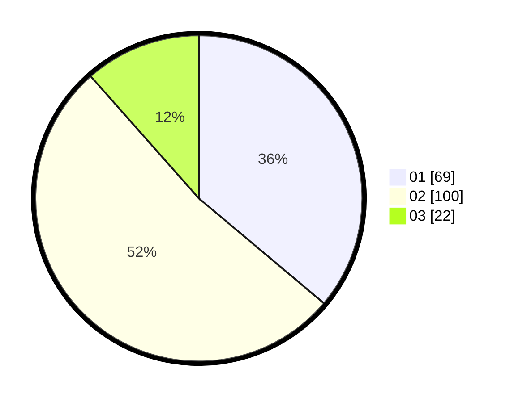

# Hasil

Hasil perolehan suara paslon dapat dilihat pada file paslon-01.txt, paslon-02.txt, dan paslon-03.txt.

Jika tidak ada, artinya data tersebut belum ada pada SIREKAP.

## Perolehan Suara

 * Paslon 01: **69**.
 * Paslon 02: **100**.
 * Paslon 03: **22**.

## Foto C Plano

https://sirekap-obj-formc.kpu.go.id/1aa7/pemilu/ppwp/31/72/04/10/05/3172041005024-20240215-221725--2f4c68ea-5a43-446f-ba8b-57df2191edcc.jpg

https://sirekap-obj-formc.kpu.go.id/1aa7/pemilu/ppwp/31/72/04/10/05/3172041005024-20240215-225927--3821b711-1b91-4761-b256-89653ad16179.jpg

https://sirekap-obj-formc.kpu.go.id/1aa7/pemilu/ppwp/31/72/04/10/05/3172041005024-20240215-223843--4069ee07-9e5d-4d45-b03d-9cafbc35f7c2.jpg

## DATA PEMILIH TETAP

Jumlah pemilih dalam DPT: **283**.
 * L: **145**.
 * P: **138**.

## DATA PENGGUNA HAK PILIH

Jumlah pengguna hak pilih dalam DPT: **184**.
 * L: **94**.
 * P: **90**.

Jumlah pengguna hak pilih dalam DPTb: **3**.
 * L: **3**.
 * P: **0**.

Jumlah pengguna hak pilih dalam DPK: **5**.
 * L: **4**.
 * P: **1**.

Jumlah pengguna hak pilih: **192**.
 * L: **101**.
 * P: **91**.

## JUMLAH SUARA SAH DAN TIDAK SAH

JUMLAH SELURUH SUARA SAH: **191**.

JUMLAH SUARA TIDAK SAH: **1**.

JUMLAH SELURUH SUARA SAH DAN SUARA TIDAK SAH: **192**.
