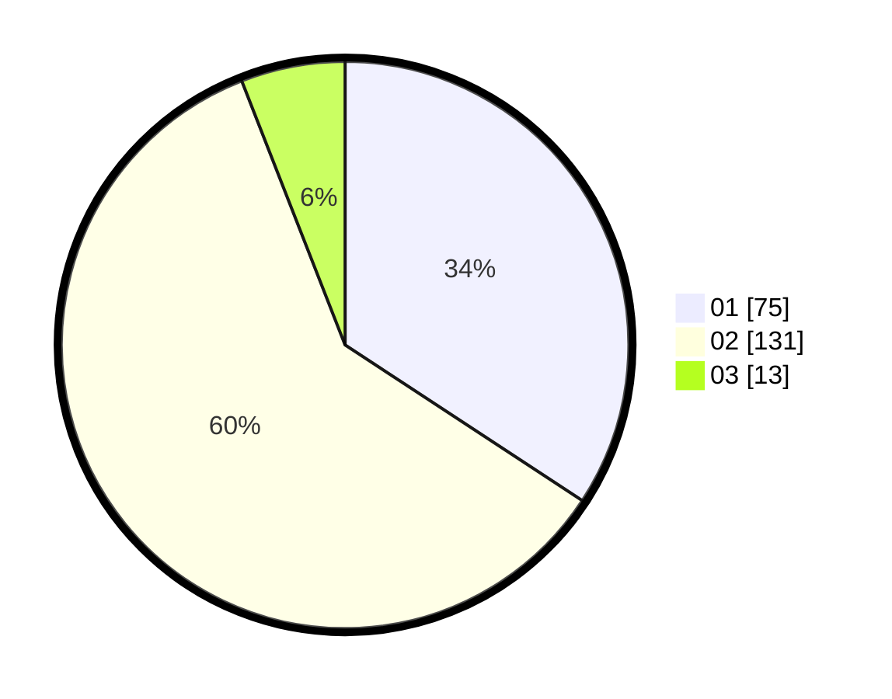

# Hasil

Hasil perolehan suara paslon dapat dilihat pada file paslon-01.txt, paslon-02.txt, dan paslon-03.txt.

Jika tidak ada, artinya data tersebut belum ada pada SIREKAP.

## Perolehan Suara

 * Paslon 01: **75**.
 * Paslon 02: **131**.
 * Paslon 03: **13**.

## Foto C Plano

https://sirekap-obj-formc.kpu.go.id/6d47/pemilu/ppwp/31/72/04/10/05/3172041005028-20240214-221605--a6b717d6-a634-4f62-b497-52f04e9afd3e.jpg

https://sirekap-obj-formc.kpu.go.id/6d47/pemilu/ppwp/31/72/04/10/05/3172041005028-20240214-221610--3b9ee384-e5c2-4603-9527-b5f42ebe1647.jpg

https://sirekap-obj-formc.kpu.go.id/6d47/pemilu/ppwp/31/72/04/10/05/3172041005028-20240214-221615--e68b5446-d2bf-4dbd-94b7-a9fd2dec8678.jpg

## DATA PEMILIH TETAP

Jumlah pemilih dalam DPT: **283**.
 * L: **143**.
 * P: **140**.

## DATA PENGGUNA HAK PILIH

Jumlah pengguna hak pilih dalam DPT: **221**.
 * L: **99**.
 * P: **122**.

Jumlah pengguna hak pilih dalam DPTb: **0**.
 * L: **0**.
 * P: **0**.

Jumlah pengguna hak pilih dalam DPK: **1**.
 * L: **0**.
 * P: **1**.

Jumlah pengguna hak pilih: **222**.
 * L: **99**.
 * P: **123**.

## JUMLAH SUARA SAH DAN TIDAK SAH

JUMLAH SELURUH SUARA SAH: **219**.

JUMLAH SUARA TIDAK SAH: **3**.

JUMLAH SELURUH SUARA SAH DAN SUARA TIDAK SAH: **222**.
