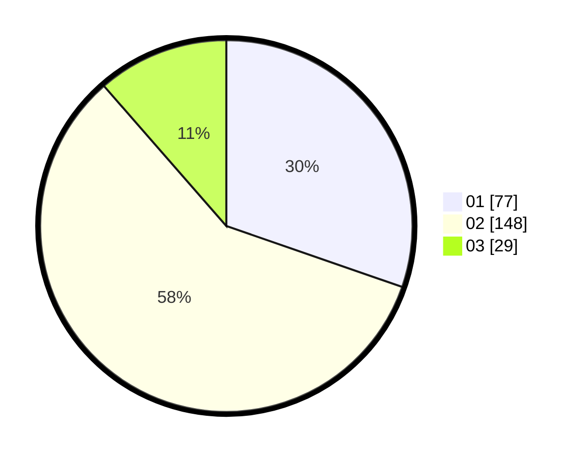

# Hasil

Hasil perolehan suara paslon dapat dilihat pada file paslon-01.txt, paslon-02.txt, dan paslon-03.txt.

Jika tidak ada, artinya data tersebut belum ada pada SIREKAP.

## Perolehan Suara

 * Paslon 01: **77**.
 * Paslon 02: **148**.
 * Paslon 03: **29**.

## Foto C Plano

https://sirekap-obj-formc.kpu.go.id/ca44/pemilu/ppwp/31/72/04/10/05/3172041005036-20240214-215148--311d16e8-abb6-4274-aabf-9226e6f3ea00.jpg

https://sirekap-obj-formc.kpu.go.id/ca44/pemilu/ppwp/31/72/04/10/05/3172041005036-20240214-215333--2a19d741-3e84-47a7-8cab-6a2fd1a058c9.jpg

https://sirekap-obj-formc.kpu.go.id/ca44/pemilu/ppwp/31/72/04/10/05/3172041005036-20240214-215436--1eaf1289-9d3c-4a85-8fdf-6cce1363709c.jpg

## DATA PEMILIH TETAP

Jumlah pemilih dalam DPT: **290**.
 * L: **154**.
 * P: **136**.

## DATA PENGGUNA HAK PILIH

Jumlah pengguna hak pilih dalam DPT: **253**.
 * L: **134**.
 * P: **119**.

Jumlah pengguna hak pilih dalam DPTb: **1**.
 * L: **0**.
 * P: **1**.

Jumlah pengguna hak pilih dalam DPK: **1**.
 * L: **1**.
 * P: **0**.

Jumlah pengguna hak pilih: **255**.
 * L: **135**.
 * P: **120**.

## JUMLAH SUARA SAH DAN TIDAK SAH

JUMLAH SELURUH SUARA SAH: **254**.

JUMLAH SUARA TIDAK SAH: **1**.

JUMLAH SELURUH SUARA SAH DAN SUARA TIDAK SAH: **255**.
