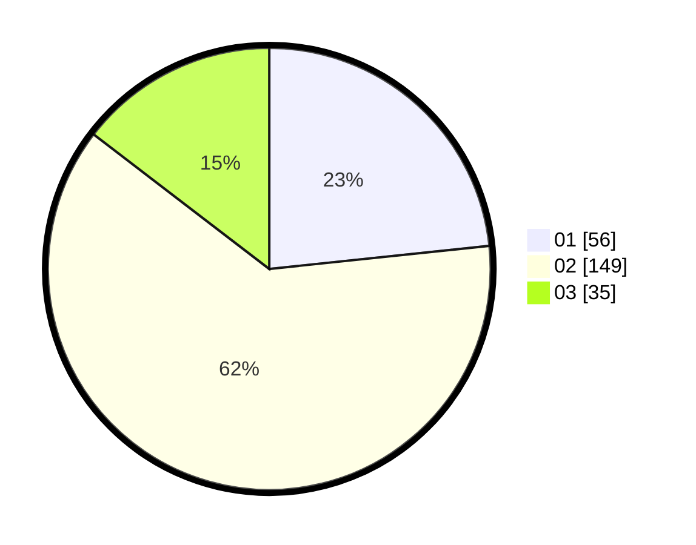

# Hasil

Hasil perolehan suara paslon dapat dilihat pada file paslon-01.txt, paslon-02.txt, dan paslon-03.txt.

Jika tidak ada, artinya data tersebut belum ada pada SIREKAP.

## Perolehan Suara

 * Paslon 01: **56**.
 * Paslon 02: **149**.
 * Paslon 03: **35**.

## Foto C Plano

https://sirekap-obj-formc.kpu.go.id/77af/pemilu/ppwp/31/72/04/10/05/3172041005056-20240215-000854--3fac3885-2ba8-497c-981e-169c683c457f.jpg

https://sirekap-obj-formc.kpu.go.id/77af/pemilu/ppwp/31/72/04/10/05/3172041005056-20240215-001203--644d7412-7b24-40bd-a185-56e55cf0390a.jpg

https://sirekap-obj-formc.kpu.go.id/77af/pemilu/ppwp/31/72/04/10/05/3172041005056-20240215-001458--dca589ac-29cc-437c-ae17-44c2114ffdcd.jpg

## DATA PEMILIH TETAP

Jumlah pemilih dalam DPT: **292**.
 * L: **150**.
 * P: **142**.

## DATA PENGGUNA HAK PILIH

Jumlah pengguna hak pilih dalam DPT: **241**.
 * L: **118**.
 * P: **123**.

Jumlah pengguna hak pilih dalam DPTb: **1**.
 * L: **1**.
 * P: **0**.

Jumlah pengguna hak pilih dalam DPK: **3**.
 * L: **3**.
 * P: **0**.

Jumlah pengguna hak pilih: **245**.
 * L: **122**.
 * P: **123**.

## JUMLAH SUARA SAH DAN TIDAK SAH

JUMLAH SELURUH SUARA SAH: **240**.

JUMLAH SUARA TIDAK SAH: **5**.

JUMLAH SELURUH SUARA SAH DAN SUARA TIDAK SAH: **245**.
