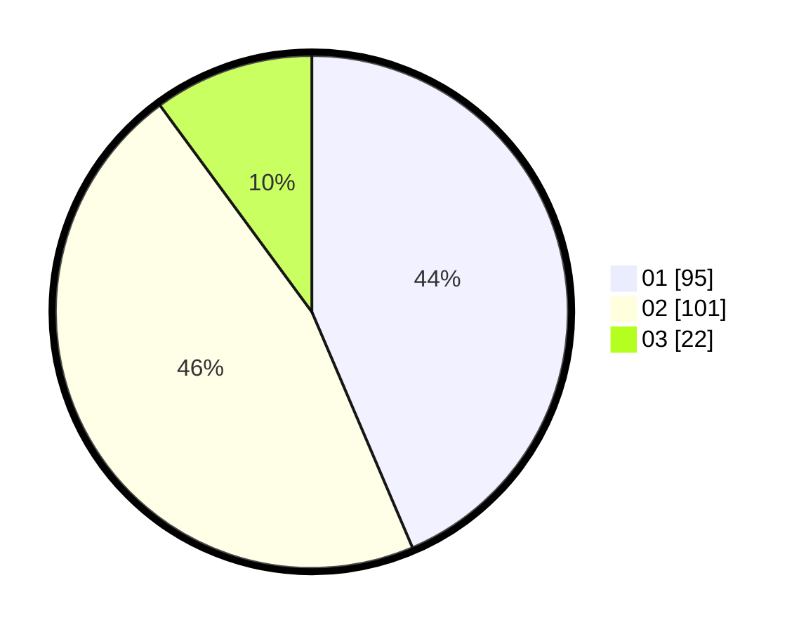

# Hasil

Hasil perolehan suara paslon dapat dilihat pada file paslon-01.txt, paslon-02.txt, dan paslon-03.txt.

Jika tidak ada, artinya data tersebut belum ada pada SIREKAP.

## Perolehan Suara

 * Paslon 01: **95**.
 * Paslon 02: **101**.
 * Paslon 03: **22**.

## Foto C Plano

https://sirekap-obj-formc.kpu.go.id/9b97/pemilu/ppwp/31/72/04/10/05/3172041005058-20240216-020851--59c36ed7-abb5-4605-b3ce-dd7caf62e87a.jpg

https://sirekap-obj-formc.kpu.go.id/9b97/pemilu/ppwp/31/72/04/10/05/3172041005058-20240216-020852--019465c9-9791-4edb-aaad-7ae32e88b96e.jpg

https://sirekap-obj-formc.kpu.go.id/9b97/pemilu/ppwp/31/72/04/10/05/3172041005058-20240216-020852--d622d2c5-e742-4eb6-9dfc-81693722d010.jpg

## DATA PEMILIH TETAP

Jumlah pemilih dalam DPT: **280**.
 * L: **133**.
 * P: **147**.

## DATA PENGGUNA HAK PILIH

Jumlah pengguna hak pilih dalam DPT: **210**.
 * L: **96**.
 * P: **114**.

Jumlah pengguna hak pilih dalam DPTb: **7**.
 * L: **6**.
 * P: **1**.

Jumlah pengguna hak pilih dalam DPK: **3**.
 * L: **1**.
 * P: **2**.

Jumlah pengguna hak pilih: **220**.
 * L: **103**.
 * P: **116**.

## JUMLAH SUARA SAH DAN TIDAK SAH

JUMLAH SELURUH SUARA SAH: **218**.

JUMLAH SUARA TIDAK SAH: **2**.

JUMLAH SELURUH SUARA SAH DAN SUARA TIDAK SAH: **220**.
