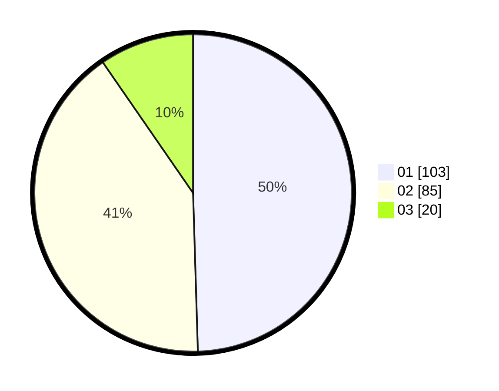

# Hasil

Hasil perolehan suara paslon dapat dilihat pada file paslon-01.txt, paslon-02.txt, dan paslon-03.txt.

Jika tidak ada, artinya data tersebut belum ada pada SIREKAP.

## Perolehan Suara

 * Paslon 01: **103**.
 * Paslon 02: **85**.
 * Paslon 03: **20**.

## Foto C Plano

https://sirekap-obj-formc.kpu.go.id/6729/pemilu/ppwp/31/72/04/10/05/3172041005060-20240214-201832--030a8509-b3ba-4d2d-9067-36e14e9ece4f.jpg

https://sirekap-obj-formc.kpu.go.id/6729/pemilu/ppwp/31/72/04/10/05/3172041005060-20240214-141510--6a293f73-f1e2-405d-913d-307320955eb4.jpg

https://sirekap-obj-formc.kpu.go.id/6729/pemilu/ppwp/31/72/04/10/05/3172041005060-20240214-201851--26d86f7a-1701-457c-bbeb-dbebbf656120.jpg

## DATA PEMILIH TETAP

Jumlah pemilih dalam DPT: **287**.
 * L: **135**.
 * P: **152**.

## DATA PENGGUNA HAK PILIH

Jumlah pengguna hak pilih dalam DPT: **208**.
 * L: **89**.
 * P: **119**.

Jumlah pengguna hak pilih dalam DPTb: **1**.
 * L: **1**.
 * P: **0**.

Jumlah pengguna hak pilih dalam DPK: **2**.
 * L: **2**.
 * P: **0**.

Jumlah pengguna hak pilih: **211**.
 * L: **92**.
 * P: **119**.

## JUMLAH SUARA SAH DAN TIDAK SAH

JUMLAH SELURUH SUARA SAH: **208**.

JUMLAH SUARA TIDAK SAH: **3**.

JUMLAH SELURUH SUARA SAH DAN SUARA TIDAK SAH: **211**.
