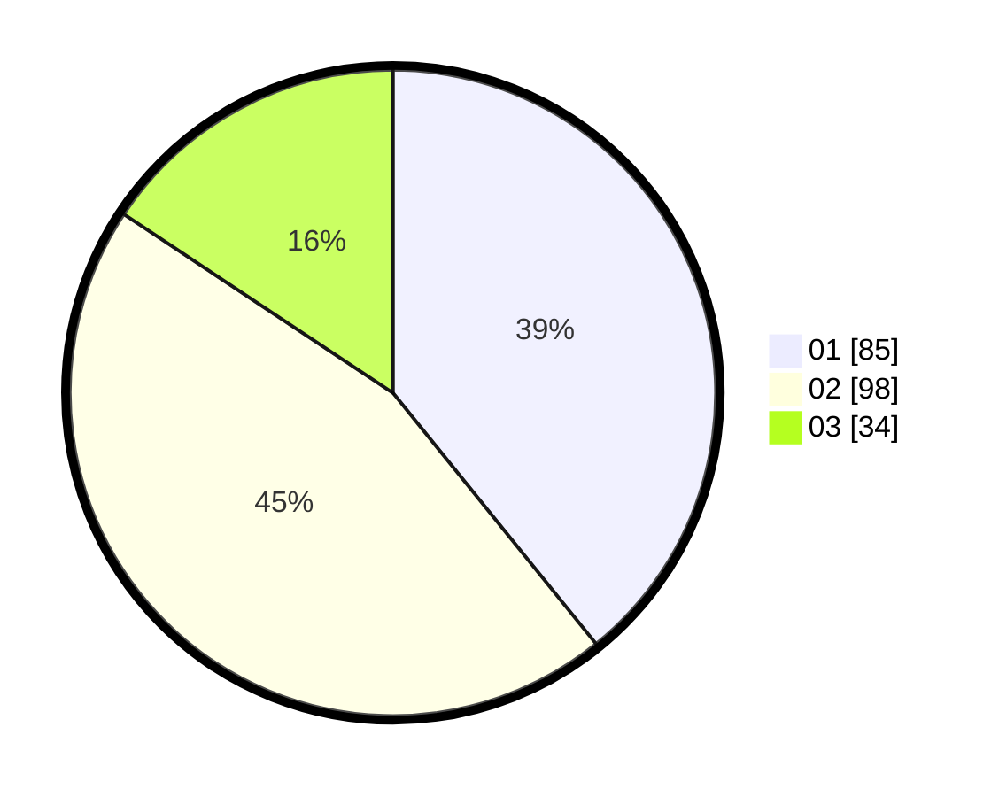

# Hasil

Hasil perolehan suara paslon dapat dilihat pada file paslon-01.txt, paslon-02.txt, dan paslon-03.txt.

Jika tidak ada, artinya data tersebut belum ada pada SIREKAP.

## Perolehan Suara

 * Paslon 01: **85**.
 * Paslon 02: **98**.
 * Paslon 03: **34**.

## Foto C Plano

https://sirekap-obj-formc.kpu.go.id/812f/pemilu/ppwp/31/72/04/10/05/3172041005062-20240214-160132--9ed04baf-5c6b-45bb-aa9c-b35cdf486753.jpg

https://sirekap-obj-formc.kpu.go.id/812f/pemilu/ppwp/31/72/04/10/05/3172041005062-20240214-155851--c38253a1-50a9-4301-86de-b55769f71d47.jpg

https://sirekap-obj-formc.kpu.go.id/812f/pemilu/ppwp/31/72/04/10/05/3172041005062-20240214-160131--e81b7b6f-f63d-4e02-b442-1bc28ae48cd5.jpg

## DATA PEMILIH TETAP

Jumlah pemilih dalam DPT: **276**.
 * L: **136**.
 * P: **140**.

## DATA PENGGUNA HAK PILIH

Jumlah pengguna hak pilih dalam DPT: **215**.
 * L: **100**.
 * P: **115**.

Jumlah pengguna hak pilih dalam DPTb: **2**.
 * L: **1**.
 * P: **1**.

Jumlah pengguna hak pilih dalam DPK: **0**.
 * L: **0**.
 * P: **0**.

Jumlah pengguna hak pilih: **217**.
 * L: **101**.
 * P: **116**.

## JUMLAH SUARA SAH DAN TIDAK SAH

JUMLAH SELURUH SUARA SAH: **220**.

JUMLAH SUARA TIDAK SAH: **7**.

JUMLAH SELURUH SUARA SAH DAN SUARA TIDAK SAH: **227**.
